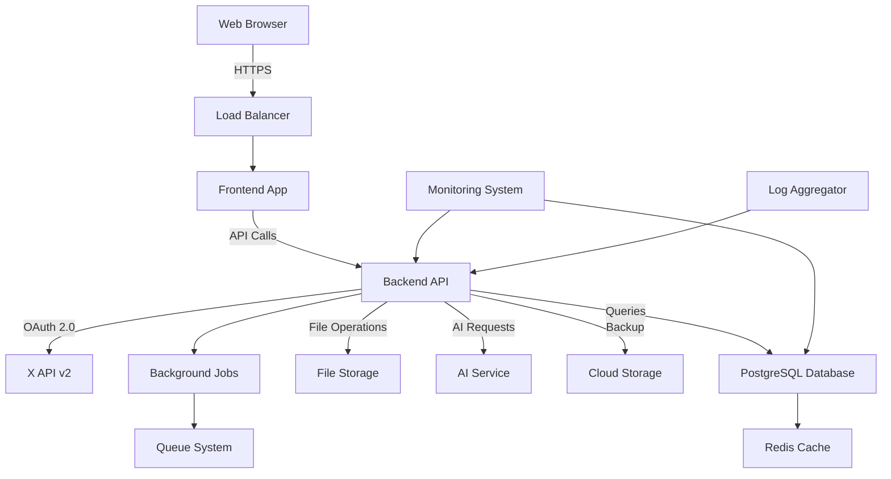

# Design Document

## Overview
The X Bookmarker is a web application that provides advanced bookmark management capabilities for X (Twitter) users, featuring intelligent categorization, powerful search functionality, and robust data management. The system integrates with X API v2 for data retrieval and leverages AI services for automated content organization while maintaining high performance with support for 10,000+ bookmarks.

## Architecture
### High-Level Architecture



### System Components

- **Frontend App**: React-based SPA with responsive design and offline capabilities
- **Backend API**: Node.js/Express REST API with authentication and rate limiting
- **PostgreSQL Database**: Primary data storage with full-text search capabilities
- **Redis Cache**: Session storage and query result caching
- **File Storage**: Local/cloud storage for media files and exports
- **Background Jobs**: Async processing for data imports and AI analysis
- **X API Integration**: OAuth-based bookmark data retrieval
- **AI Service**: Content analysis for auto-categorization and tagging
- **Cloud Storage**: AWS S3 for backups and media archival
- **Monitoring System**: Application performance and health monitoring

## Components and Interfaces

### Core Interfaces

```typescript
interface User {
  id: string;
  xUserId: string;
  username: string;
  displayName: string;
  avatarUrl?: string;
  accessToken: string;
  refreshToken: string;
  tokenExpiresAt: Date;
  settings: UserSettings;
  createdAt: Date;
  updatedAt: Date;
}

interface UserSettings {
  theme: 'light' | 'dark';
  viewMode: 'grid' | 'list';
  defaultCategory?: string;
  autoSync: boolean;
  backupEnabled: boolean;
  aiSuggestions: boolean;
}

interface Bookmark {
  id: string;
  userId: string;
  xTweetId: string;
  content: string;
  authorUsername: string;
  authorDisplayName: string;
  authorAvatarUrl?: string;
  mediaUrls: string[];
  links: string[];
  hashtags: string[];
  mentions: string[];
  categoryId?: string;
  tags: string[];
  isArchived: boolean;
  bookmarkedAt: Date;
  createdAt: Date;
  updatedAt: Date;
  searchVector?: string; // Full-text search vector
}

interface Category {
  id: string;
  userId: string;
  name: string;
  description?: string;
  color: string;
  icon: string;
  parentId?: string;
  order: number;
  isDefault: boolean;
  createdAt: Date;
  updatedAt: Date;
}

interface Tag {
  id: string;
  userId: string;
  name: string;
  color?: string;
  usageCount: number;
  createdAt: Date;
  updatedAt: Date;
}

interface SearchQuery {
  text?: string;
  categoryIds?: string[];
  tags?: string[];
  authorUsername?: string;
  dateFrom?: Date;
  dateTo?: Date;
  hasMedia?: boolean;
  hasLinks?: boolean;
  sortBy: 'relevance' | 'date' | 'author';
  sortOrder: 'asc' | 'desc';
  limit: number;
  offset: number;
}

interface SearchResult {
  bookmarks: Bookmark[];
  totalCount: number;
  facets: {
    categories: { id: string; name: string; count: number }[];
    tags: { name: string; count: number }[];
    authors: { username: string; displayName: string; count: number }[];
  };
  queryTime: number;
}

interface SyncJob {
  id: string;
  userId: string;
  status: 'pending' | 'running' | 'completed' | 'failed';
  progress: number;
  totalItems: number;
  processedItems: number;
  errorMessage?: string;
  startedAt?: Date;
  completedAt?: Date;
}
```

### Frontend App
**Responsibilities:**
- User interface rendering and interaction
- Client-side routing and state management
- Real-time sync progress display
- Offline functionality with local storage
- Responsive design across devices

**Key Methods:**
- `authenticateWithX()`: Initiate OAuth flow
- `syncBookmarks()`: Trigger bookmark import
- `searchBookmarks(query: SearchQuery)`: Execute search
- `createCategory(category: CategoryInput)`: Create new category
- `assignBookmarkToCategory(bookmarkId, categoryId)`: Categorize bookmark
- `exportData(format: 'json' | 'csv')`: Export user data

### Backend API
**Responsibilities:**
- RESTful API endpoints
- Authentication and session management
- Rate limiting and request validation
- Background job orchestration
- File upload and media handling

**Key Methods:**
- `POST /auth/x/oauth`: Initialize X OAuth flow
- `GET /auth/x/callback`: Handle OAuth callback
- `GET /bookmarks`: Retrieve user bookmarks
- `POST /bookmarks/sync`: Start sync job
- `GET /categories`: Get user categories
- `POST /categories`: Create category
- `GET /search`: Search bookmarks
- `POST /export`: Export data

### X API Service
**Responsibilities:**
- OAuth 2.0 authentication flow
- Bookmark data retrieval with pagination
- Rate limit handling and retry logic
- Token refresh management
- API error handling

**Key Methods:**
- `authenticateUser(authCode: string)`: Complete OAuth flow
- `fetchBookmarks(userId: string, pagination?: PaginationToken)`: Get bookmarks
- `refreshAccessToken(refreshToken: string)`: Renew expired token
- `handleRateLimit()`: Implement backoff strategy

### AI Service
**Responsibilities:**
- Content analysis and categorization
- Tag suggestion generation
- Sentiment analysis
- Language detection
- Batch processing optimization

**Key Methods:**
- `analyzeContent(text: string)`: Extract insights from tweet content
- `suggestCategories(bookmark: Bookmark)`: Recommend categories
- `generateTags(content: string)`: Suggest relevant tags
- `batchAnalyze(bookmarks: Bookmark[])`: Process multiple items efficiently

### Database Service
**Responsibilities:**
- Data persistence and retrieval
- Full-text search implementation
- Query optimization
- Data integrity maintenance
- Backup and recovery

**Key Methods:**
- `createBookmark(bookmark: BookmarkInput)`: Store new bookmark
- `searchBookmarks(query: SearchQuery)`: Execute complex search
- `updateBookmarkCategories(bookmarkIds: string[], categoryId: string)`: Bulk update
- `generateSearchVector(content: string)`: Create search index
- `backupData(userId: string)`: Export user data

## Data Models

### Database Schema

```sql
-- Users table
CREATE TABLE users (
  id UUID PRIMARY KEY DEFAULT gen_random_uuid(),
  x_user_id VARCHAR(50) UNIQUE NOT NULL,
  username VARCHAR(255) NOT NULL,
  display_name VARCHAR(255) NOT NULL,
  avatar_url TEXT,
  access_token TEXT NOT NULL,
  refresh_token TEXT NOT NULL,
  token_expires_at TIMESTAMP WITH TIME ZONE NOT NULL,
  settings JSONB DEFAULT '{}',
  created_at TIMESTAMP WITH TIME ZONE DEFAULT NOW(),
  updated_at TIMESTAMP WITH TIME ZONE DEFAULT NOW()
);

-- Categories table
CREATE TABLE categories (
  id UUID PRIMARY KEY DEFAULT gen_random_uuid(),
  user_id UUID NOT NULL REFERENCES users(id) ON DELETE CASCADE,
  name VARCHAR(255) NOT NULL,
  description TEXT,
  color VARCHAR(7) NOT NULL DEFAULT '#3B82F6',
  icon VARCHAR(50) NOT NULL DEFAULT 'folder',
  parent_id UUID REFERENCES categories(id) ON DELETE SET NULL,
  "order" INTEGER NOT NULL DEFAULT 0,
  is_default BOOLEAN DEFAULT FALSE,
  created_at TIMESTAMP WITH TIME ZONE DEFAULT NOW(),
  updated_at TIMESTAMP WITH TIME ZONE DEFAULT NOW(),
  UNIQUE(user_id, name)
);

-- Tags table
CREATE TABLE tags (
  id UUID PRIMARY KEY DEFAULT gen_random_uuid(),
  user_id UUID NOT NULL REFERENCES users(id) ON DELETE CASCADE,
  name VARCHAR(255) NOT NULL,
  color VARCHAR(7),
  usage_count INTEGER DEFAULT 0,
  created_at TIMESTAMP WITH TIME ZONE DEFAULT NOW(),
  updated_at TIMESTAMP WITH TIME ZONE DEFAULT NOW(),
  UNIQUE(user_id, name)
);

-- Bookmarks table
CREATE TABLE bookmarks (
  id UUID PRIMARY KEY DEFAULT gen_random_uuid(),
  user_id UUID NOT NULL REFERENCES users(id) ON DELETE CASCADE,
  x_tweet_id VARCHAR(50) NOT NULL,
  content TEXT NOT NULL,
  author_username VARCHAR(255) NOT NULL,
  author_display_name VARCHAR(255) NOT NULL,
  author_avatar_url TEXT,
  media_urls TEXT[] DEFAULT '{}',
  links TEXT[] DEFAULT '{}',
  hashtags TEXT[] DEFAULT '{}',
  mentions TEXT[] DEFAULT '{}',
  category_id UUID REFERENCES categories(id) ON DELETE SET NULL,
  tags TEXT[] DEFAULT '{}',
  is_archived BOOLEAN DEFAULT FALSE,
  bookmarked_at TIMESTAMP WITH TIME ZONE NOT NULL,
  search_vector tsvector,
  created_at TIMESTAMP WITH TIME ZONE DEFAULT NOW(),
  updated_at TIMESTAMP WITH TIME ZONE DEFAULT NOW(),
  UNIQUE(user_id, x_tweet_id)
);

-- Sync jobs table
CREATE TABLE sync_jobs (
  id UUID PRIMARY KEY DEFAULT gen_random_uuid(),
  user_id UUID NOT NULL REFERENCES users(id) ON DELETE CASCADE,
  status VARCHAR(20) NOT NULL DEFAULT 'pending',
  progress INTEGER DEFAULT 0,
  total_items INTEGER DEFAULT 0,
  processed_items INTEGER DEFAULT 0,
  error_message TEXT,
  started_at TIMESTAMP WITH TIME ZONE,
  completed_at TIMESTAMP WITH TIME ZONE,
  created_at TIMESTAMP WITH TIME ZONE DEFAULT NOW()
);

-- Search history table
CREATE TABLE search_history (
  id UUID PRIMARY KEY DEFAULT gen_random_uuid(),
  user_id UUID NOT NULL REFERENCES users(id) ON DELETE CASCADE,
  query JSONB NOT NULL,
  result_count INTEGER NOT NULL,
  execution_time INTEGER NOT NULL, -- milliseconds
  created_at TIMESTAMP WITH TIME ZONE DEFAULT NOW()
);

-- Indexes for performance
CREATE INDEX idx_bookmarks_user_id ON bookmarks(user_id);
CREATE INDEX idx_bookmarks_category_id ON bookmarks(category_id);
CREATE INDEX idx_bookmarks_bookmarked_at ON bookmarks(bookmarked_at DESC);
CREATE INDEX idx_bookmarks_author ON bookmarks(author_username);
CREATE INDEX idx_bookmarks_tags ON bookmarks USING GIN(tags);
CREATE INDEX idx_bookmarks_hashtags ON bookmarks USING GIN(hashtags);
CREATE INDEX idx_bookmarks_search_vector ON bookmarks USING GIN(search_vector);
CREATE INDEX idx_categories_user_order ON categories(user_id, "order");
CREATE INDEX idx_sync_jobs_status ON sync_jobs(status) WHERE status IN ('pending', 'running');

-- Full-text search trigger
CREATE OR REPLACE FUNCTION update_bookmark_search_vector()
RETURNS TRIGGER AS $$
BEGIN
  NEW.search_vector = setweight(to_tsvector('english', coalesce(NEW.content, '')), 'A') ||
                      setweight(to_tsvector('english', coalesce(NEW.author_display_name, '')), 'B') ||
                      setweight(to_tsvector('english', array_to_string(NEW.tags, ' ')), 'C') ||
                      setweight(to_tsvector('english', array_to_string(NEW.hashtags, ' ')), 'D');
  RETURN NEW;
END;
$$ LANGUAGE plpgsql;

CREATE TRIGGER update_bookmark_search_vector_trigger
  BEFORE INSERT OR UPDATE ON bookmarks
  FOR EACH ROW EXECUTE FUNCTION update_bookmark_search_vector();
```

### File Storage Structure

```
/storage/
├── users/
│   └── {user_id}/
│       ├── media/
│       │   ├── images/
│       │   │   └── {tweet_id}_{index}.{ext}
│       │   └── videos/
│       │       └── {tweet_id}_{index}.{ext}
│       ├── exports/
│       │   ├── {timestamp}_bookmarks.json
│       │   ├── {timestamp}_bookmarks.csv
│       │   └── {timestamp}_full_backup.zip
│       └── temp/
│           └── {job_id}/
├── backups/
│   ├── daily/
│   │   └── {date}_database_backup.sql
│   └── weekly/
│       └── {date}_full_system_backup.tar.gz
└── logs/
    ├── api/
    │   └── {date}_api.log
    ├── sync/
    │   └── {date}_sync.log
    └── errors/
        └── {date}_errors.log
```

### Configuration Schema

```json
{
  "$schema": "http://json-schema.org/draft-07/schema#",
  "title": "X Bookmarker Configuration",
  "type": "object",
  "properties": {
    "app": {
      "type": "object",
      "properties": {
        "name": { "type": "string", "default": "X Bookmarker" },
        "version": { "type": "string" },
        "environment": { "enum": ["development", "staging", "production"] },
        "port": { "type": "integer", "default": 3000 },
        "baseUrl": { "type": "string", "format": "uri" }
      },
      "required": ["version", "environment", "baseUrl"]
    },
    "database": {
      "type": "object",
      "properties": {
        "host": { "type": "string" },
        "port": { "type": "integer", "default": 5432 },
        "name": { "type": "string" },
        "user": { "type": "string" },
        "password": { "type": "string" },
        "ssl": { "type": "boolean", "default": true },
        "poolSize": { "type": "integer", "default": 10 }
      },
      "required": ["host", "name", "user", "password"]
    },
    "redis": {
      "type": "object",
      "properties": {
        "host": { "type": "string" },
        "port": { "type": "integer", "default": 6379 },
        "password": { "type": "string" },
        "db": { "type": "integer", "default": 0 }
      },
      "required": ["host"]
    },
    "xApi": {
      "type": "object",
      "properties": {
        "clientId": { "type": "string" },
        "clientSecret": { "type": "string" },
        "redirectUri": { "type": "string", "format": "uri" },
        "scopes": { 
          "type": "array", 
          "items": { "type": "string" },
          "default": ["tweet.read", "users.read", "bookmark.read"]
        },
        "rateLimitStrategy": {
          "type": "object",
          "properties": {
            "requestsPerWindow": { "type": "integer", "default": 75 },
            "windowMs": { "type": "integer", "default": 900000 },
            "retryAfterMs": { "type": "integer", "default": 60000 }
          }
        }
      },
      "required": ["clientId", "clientSecret", "redirectUri"]
    },
    "ai": {
      "type": "object",
      "properties": {
        "provider": { "enum": ["openai", "anthropic", "huggingface"] },
        "apiKey": { "type": "string" },
        "model": { "type": "string" },
        "maxTokens": { "type": "integer", "default": 1000 },
        "temperature": { "type": "number", "minimum": 0, "maximum": 1, "default": 0.3 }
      },
      "required": ["provider", "apiKey", "model"]
    },
    "storage": {
      "type": "object",
      "properties": {
        "provider": { "enum": ["local", "s3", "gcs"] },
        "basePath": { "type": "string", "default": "./storage" },
        "maxFileSize": { "type": "integer", "default": 10485760 },
        "allowedTypes": {
          "type": "array",
          "items": { "type": "string" },
          "default": ["image/jpeg", "image/png", "image/webp", "video/mp4"]
        },
        "s3": {
          "type": "object",
          "properties": {
            "region": { "type": "string" },
            "bucket": { "type": "string" },
            "accessKeyId": { "type": "string" },
            "secretAccessKey": { "type": "string" }
          }
        }
      },
      "required": ["provider"]
    },
    "security": {
      "type": "object",
      "properties": {
        "jwtSecret": { "type": "string", "minLength": 32 },
        "sessionTimeout": { "type": "integer", "default": 3600 },
        "rateLimitRequests": { "type": "integer", "default": 100 },
        "rateLimitWindow": { "type": "integer", "default": 900000 },
        "corsOrigins": {
          "type": "array",
          "items": { "type": "string" }
        }
      },
      "required": ["jwtSecret"]
    },
    "monitoring": {
      "type": "object",
      "properties": {
        "enabled": { "type": "boolean", "default": true },
        "logLevel": { 
          "enum": ["error", "warn", "info", "debug"], 
          "default": "info" 
        },
        "metricsEndpoint": { "type": "string" },
        "alerting": {
          "type": "object",
          "properties": {
            "webhookUrl": { "type": "string", "format": "uri" },
            "errorThreshold": { "type": "integer", "default": 10 },
            "responseTimeThreshold": { "type": "integer", "default": 5000 }
          }
        }
      }
    }
  },
  "required": ["app", "database", "xApi", "security"]
}
```

## Error Handling

### API Error Categories
- **X API Errors**: Rate limiting, authentication failures, data unavailability
- **Database Errors**: Connection failures, constraint violations, query timeouts
- **File System Errors**: Disk space, permissions, corruption
- **User Input Errors**: Validation failures, malformed requests
- **System Errors**: Memory exhaustion, service unavailability

### Error Handling Strategies

#### X API Integration
```typescript
class XApiErrorHandler {
  async handleRateLimit(error: RateLimitError): Promise<void> {
    const resetTime = error.headers['x-rate-limit-reset'];
    const waitTime = Math.max(parseInt(resetTime) * 1000 - Date.now(), 60000);
    
    await this.scheduleRetry(waitTime);
    this.notifyUser('Rate limit reached. Retrying automatically.');
  }
  
  async handleAuthError(error: AuthError): Promise<void> {
    if (error.code === 'invalid_token') {
      await this.refreshToken();
    } else {
      throw new UserActionRequiredError('Please re-authenticate with X');
    }
  }
}
```

#### Circuit Breaker Pattern
```typescript
class CircuitBreaker {
  private failureCount = 0;
  private lastFailureTime = 0;
  private state: 'CLOSED' | 'OPEN' | 'HALF_OPEN' = 'CLOSED';
  
  async execute<T>(operation: () => Promise<T>): Promise<T> {
    if (this.state === 'OPEN') {
      if (Date.now() - this.lastFailureTime > this.timeout) {
        this.state = 'HALF_OPEN';
      } else {
        throw new ServiceUnavailableError('Circuit breaker is open');
      }
    }
    
    try {
      const result = await operation();
      this.onSuccess();
      return result;
    } catch (error) {
      this.onFailure();
      throw error;
    }
  }
}
```

#### Database Transaction Safety
```typescript
async function safeTransaction<T>(operation: (tx: Transaction) => Promise<T>): Promise<T> {
  const tx = await database.beginTransaction();
  try {
    const result = await operation(tx);
    await tx.commit();
    return result;
  } catch (error) {
    await tx.rollback();
    if (error instanceof ConstraintViolationError) {
      throw new BusinessLogicError('Operation conflicts with existing data');
    }
    throw error;
  }
}
```

## Testing Strategy

### Unit Testing (Target: 85% Coverage)
- **Components**: React component rendering and interaction
- **Services**: API clients, data transformations, business logic
- **Utilities**: Helper functions, validators, formatters
- **Database**: Query builders, data access layer

### Integration Testing
- **API Endpoints**: Request/response validation, authentication flows
- **Database Operations**: Complex queries, transactions, migrations
- **External Services**: X API integration, AI service communication
- **File Operations**: Upload, download, backup procedures

### End-to-End Testing
- **User Workflows**: Complete authentication to bookmark management
- **Cross-browser Testing**: Chrome, Firefox, Safari, Edge
- **Mobile Responsiveness**: Touch interactions, responsive layouts
- **Performance Testing**: Load times, search response times

### Performance Testing
```typescript
describe('Performance Requirements', () => {
  test('should load 10,000 bookmarks within 3 seconds', async () => {
    const startTime = Date.now();
    const bookmarks = await bookmarkService.getBookmarks({ limit: 10000 });
    const loadTime = Date.now() - startTime;
    
    expect(bookmarks.length).toBe(10000);
    expect(loadTime).toBeLessThan(3000);
  });
  
  test('should return search results within 1 second', async () => {
    const query = { text: 'artificial intelligence', limit: 50 };
    const startTime = Date.now();
    const results = await searchService.search(query);
    const searchTime = Date.now() - startTime;
    
    expect(results.bookmarks.length).toBeGreaterThan(0);
    expect(searchTime).toBeLessThan(1000);
  });
});
```

### Test Data Management
- **Factories**: Automated test data generation
- **Fixtures**: Standardized test datasets
- **Cleanup**: Automated test environment reset
- **Isolation**: Independent test execution

### Continuous Integration
```yaml
# .github/workflows/test.yml
name: Test Suite
on: [push, pull_request]
jobs:
  test:
    runs-on: ubuntu-latest
    services:
      postgres:
        image: postgres:15
        env:
          POSTGRES_PASSWORD: testpass
      redis:
        image: redis:7-alpine
    steps:
      - uses: actions/checkout@v3
      - uses: actions/setup-node@v3
      - run: npm ci
      - run: npm run test:unit
      - run: npm run test:integration
      - run: npm run test:e2e
      - run: npm run test:performance
```

This comprehensive design provides a solid foundation for implementing a scalable, maintainable, and high-performance X bookmark management application that meets all specified requirements while ensuring robust error handling and thorough testing coverage.