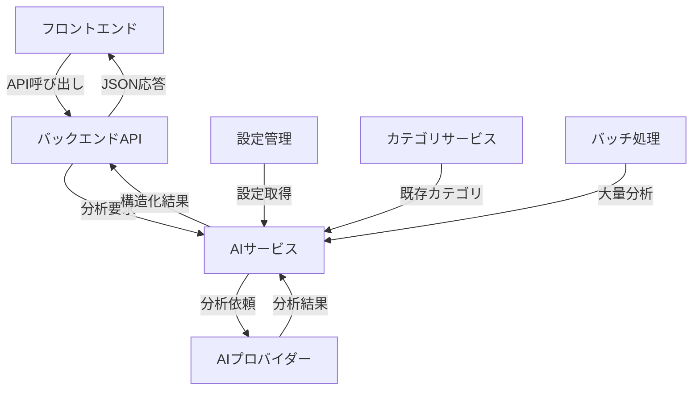

# AI分析機能 - 実装ガイド

## 概要

X BookmarkerのAI分析機能は、ブックマークされたツイートのコンテンツを自動的に分析し、適切なカテゴリ提案とタグ生成を行うシステムです。本機能により、ユーザーは大量のブックマークを効率的に整理できます。

## アーキテクチャ概要

### システム構成



### 主要コンポーネント

1. **AIサービス (`aiService.ts`)**
   - AIプロバイダーとの統合
   - 分析ロジックの統一化
   - エラーハンドリングとフォールバック

2. **AIルーター (`ai.ts`)**
   - REST APIエンドポイント
   - リクエスト検証
   - 認証・認可

3. **フロントエンドフック (`useAI.ts`)**
   - React Query統合
   - 状態管理
   - リアルタイム分析

## 設計思想

### 1. プロバイダー抽象化

複数のAIプロバイダー（OpenAI、Anthropic、Hugging Face）に対応するため、共通インターフェースを設計しました。

```typescript
export interface AIProvider {
  name: 'openai' | 'anthropic' | 'huggingface';
  client: any;
  analyze: (content: string, existingCategories: Category[]) => Promise<AIAnalysisResult>;
}
```

**設計理由:**
- プロバイダーの切り替えが容易
- 新しいプロバイダーの追加が簡単
- テスト時のモック化が容易

### 2. 段階的デグラデーション

AI分析が失敗した場合でも、システムが停止しないようフォールバック機能を実装しています。

```typescript
private getFallbackResult(): AIAnalysisResult {
  return {
    suggestedCategories: [{ categoryName: '未分類', confidence: 0.5 }],
    suggestedTags: [],
    sentiment: 'neutral',
    language: 'unknown',
    topics: []
  };
}
```

**設計理由:**
- ユーザビリティの向上
- システムの堅牢性確保
- 部分的な機能提供

### 3. コンテキスト統合分析

ブックマークの包括的な分析のため、複数の情報源を統合します。

```typescript
public async analyzeBookmark(
  bookmark: Bookmark, 
  existingCategories: Category[]
): Promise<AIAnalysisResult> {
  const fullContent = [
    bookmark.content,
    ...bookmark.hashtags.map(tag => `#${tag}`),
    ...bookmark.tags,
    bookmark.authorDisplayName
  ].join(' ');

  return await this.analyzeContent(fullContent, existingCategories);
}
```

**分析対象要素:**
- ツイート本文
- ハッシュタグ
- 既存タグ
- 投稿者名

## 実装詳細

### バックエンド実装

#### 1. AIサービス初期化

```typescript
export class AIService {
  private config: AIConfig;
  private provider: AIProvider | null = null;

  constructor() {
    this.config = {
      provider: (process.env.AI_PROVIDER as 'openai' | 'anthropic' | 'huggingface') || 'openai',
      apiKey: process.env.AI_API_KEY || '',
      model: process.env.AI_MODEL || 'gpt-4',
      maxTokens: parseInt(process.env.AI_MAX_TOKENS || '1000'),
      temperature: parseFloat(process.env.AI_TEMPERATURE || '0.3'),
      enabled: process.env.AI_ENABLED === 'true'
    };

    if (this.config.enabled && this.config.apiKey) {
      this.initializeProvider();
    }
  }
}
```

**環境変数設定:**
```bash
AI_ENABLED=true
AI_PROVIDER=openai
AI_API_KEY=your_api_key_here
AI_MODEL=gpt-4
AI_MAX_TOKENS=1000
AI_TEMPERATURE=0.3
```

#### 2. OpenAIプロバイダー実装

```typescript
private createOpenAIProvider(): AIProvider {
  const client = new OpenAI({
    apiKey: this.config.apiKey,
  });

  return {
    name: 'openai',
    client,
    analyze: async (content: string, existingCategories: Category[]): Promise<AIAnalysisResult> => {
      const categoryNames = existingCategories.map(cat => cat.name).join(', ');
      
      const prompt = `Analyze the following tweet content and provide:
1. Suggested categories from these options: [${categoryNames}] or suggest new ones
2. Relevant tags (5-10 words/phrases)
3. Sentiment (positive/negative/neutral)
4. Language detected
5. Main topics/themes

Tweet content: "${content}"

Please respond in JSON format with the following structure:
{
  "suggestedCategories": [{"categoryName": "string", "confidence": number}],
  "suggestedTags": ["string"],
  "sentiment": "positive|negative|neutral",
  "language": "string",
  "topics": ["string"]
}`;

      try {
        const response = await client.chat.completions.create({
          model: this.config.model,
          messages: [
            {
              role: 'system',
              content: 'You are an expert content analyzer. Provide accurate analysis in the requested JSON format.'
            },
            {
              role: 'user',
              content: prompt
            }
          ],
          max_tokens: this.config.maxTokens,
          temperature: this.config.temperature,
        });

        const result = response.choices[0]?.message?.content;
        if (!result) {
          throw new Error('No response from OpenAI');
        }

        return JSON.parse(result) as AIAnalysisResult;
      } catch (error) {
        console.error('OpenAI analysis error:', error);
        return this.getFallbackResult();
      }
    }
  };
}
```

#### 3. バッチ処理実装

```typescript
public async batchAnalyze(
  bookmarks: Bookmark[], 
  existingCategories: Category[],
  onProgress?: (processed: number, total: number) => void
): Promise<Map<string, AIAnalysisResult>> {
  const results = new Map<string, AIAnalysisResult>();
  
  for (let i = 0; i < bookmarks.length; i++) {
    const bookmark = bookmarks[i];
    try {
      const analysis = await this.analyzeBookmark(bookmark, existingCategories);
      results.set(bookmark.id, analysis);
      
      if (onProgress) {
        onProgress(i + 1, bookmarks.length);
      }

      // Add delay to respect rate limits
      await this.delay(100);
    } catch (error) {
      console.error(`Failed to analyze bookmark ${bookmark.id}:`, error);
      results.set(bookmark.id, this.getFallbackResult());
    }
  }

  return results;
}
```

**レート制限対応:**
- 各リクエスト間に100msの遅延
- エラー時のフォールバック処理
- プログレス通知機能

### フロントエンド実装

#### 1. React Hook実装

```typescript
export const useAnalyzeContent = () => {
  return useMutation<APIResponse<AIAnalysisResult>, Error, AnalyzeContentRequest>({
    mutationFn: (request) => apiClient.post('/ai/analyze', request),
    onError: (error) => {
      console.error('Failed to analyze content:', error);
    },
  });
};
```

#### 2. 設定UI実装

```tsx
{aiConfig.enabled && (
  <>
    <div>
      <label className="block text-sm font-medium text-gray-700 dark:text-gray-300 mb-2">
        AIプロバイダー
      </label>
      <select
        value={aiConfig.provider}
        onChange={(e) => setAiConfig({
          ...aiConfig,
          provider: e.target.value as 'openai' | 'anthropic' | 'huggingface'
        })}
        className="input"
        disabled={aiConfigLoading}
      >
        <option value="openai">OpenAI</option>
        <option value="anthropic">Anthropic (Claude)</option>
        <option value="huggingface" disabled>Hugging Face (未実装)</option>
      </select>
    </div>

    <div>
      <label className="block text-sm font-medium text-gray-700 dark:text-gray-300 mb-2">
        AIモデル
      </label>
      <select
        value={aiConfig.model}
        onChange={(e) => setAiConfig({
          ...aiConfig,
          model: e.target.value
        })}
        className="input"
        disabled={aiConfigLoading}
      >
        {aiConfig.provider === 'openai' && (
          <>
            <option value="gpt-3.5-turbo">GPT-3.5 Turbo</option>
            <option value="gpt-4">GPT-4</option>
            <option value="gpt-4-turbo">GPT-4 Turbo</option>
          </>
        )}
        {aiConfig.provider === 'anthropic' && (
          <>
            <option value="claude-3-sonnet-20240229">Claude 3 Sonnet</option>
            <option value="claude-3-opus-20240229">Claude 3 Opus</option>
            <option value="claude-3-haiku-20240307">Claude 3 Haiku</option>
          </>
        )}
      </select>
    </div>
  </>
)}
```

## API仕様

### エンドポイント一覧

#### POST /api/ai/analyze
コンテンツの単体分析

**リクエスト:**
```typescript
{
  content: string;
  bookmarkId?: string;
}
```

**レスポンス:**
```typescript
{
  success: boolean;
  data: {
    suggestedCategories: Array<{
      categoryName: string;
      confidence: number;
    }>;
    suggestedTags: string[];
    sentiment: 'positive' | 'negative' | 'neutral';
    language: string;
    topics: string[];
  };
  message?: string;
}
```

#### POST /api/ai/batch-analyze
複数ブックマークのバッチ分析（Server-Sent Events）

**リクエスト:**
```typescript
{
  bookmarkIds: string[];
}
```

**レスポンス（SSE）:**
```typescript
// Progress event
{
  type: 'progress';
  processed: number;
  total: number;
  progress: number;
}

// Complete event
{
  type: 'complete';
  results: Record<string, AIAnalysisResult>;
  message: string;
}

// Error event
{
  type: 'error';
  error: string;
}
```

#### GET /api/ai/config
AI設定取得

**レスポンス:**
```typescript
{
  success: boolean;
  data: {
    provider: 'openai' | 'anthropic' | 'huggingface';
    model: string;
    enabled: boolean;
  };
}
```

#### PUT /api/ai/config
AI設定更新

**リクエスト:**
```typescript
{
  provider?: 'openai' | 'anthropic' | 'huggingface';
  model?: string;
  enabled?: boolean;
}
```

#### GET /api/ai/health
AIサービス健康状態確認

**レスポンス:**
```typescript
{
  success: boolean;
  data: {
    enabled: boolean;
    provider: string;
    model: string;
    status: 'healthy' | 'disabled' | 'error';
  };
}
```

## セキュリティ考慮事項

### 1. APIキー管理

```typescript
// ❌ 悪い例 - フロントエンドでAPIキーを扱う
const openai = new OpenAI({
  apiKey: 'sk-...' // 露出リスク
});

// ✅ 良い例 - バックエンドでのみ管理
const aiService = new AIService(); // 環境変数から取得
```

### 2. レート制限対応

```typescript
// Rate limiting implementation
const rateLimiter = {
  requests: 0,
  windowStart: Date.now(),
  windowMs: 60000, // 1 minute
  maxRequests: 60,
  
  async checkLimit(): Promise<boolean> {
    const now = Date.now();
    if (now - this.windowStart > this.windowMs) {
      this.requests = 0;
      this.windowStart = now;
    }
    
    if (this.requests >= this.maxRequests) {
      return false; // Rate limit exceeded
    }
    
    this.requests++;
    return true;
  }
};
```

### 3. 入力サニタイゼーション

```typescript
// Zod validation schema
const analyzeContentSchema = z.object({
  content: z.string()
    .min(1, 'Content is required')
    .max(5000, 'Content too long')
    .refine(val => val.trim().length > 0, 'Content cannot be empty'),
  bookmarkId: z.string().uuid().optional(),
});
```

## パフォーマンス最適化

### 1. バッチ処理最適化

```typescript
// 並列処理（制限付き）
public async batchAnalyzeParallel(
  bookmarks: Bookmark[], 
  existingCategories: Category[],
  concurrency: number = 3
): Promise<Map<string, AIAnalysisResult>> {
  const results = new Map<string, AIAnalysisResult>();
  const chunks = this.chunkArray(bookmarks, concurrency);
  
  for (const chunk of chunks) {
    const promises = chunk.map(bookmark => 
      this.analyzeBookmark(bookmark, existingCategories)
        .catch(error => {
          console.error(`Analysis failed for ${bookmark.id}:`, error);
          return this.getFallbackResult();
        })
    );
    
    const chunkResults = await Promise.all(promises);
    
    chunk.forEach((bookmark, index) => {
      results.set(bookmark.id, chunkResults[index]);
    });
    
    // Rate limiting delay
    await this.delay(200);
  }
  
  return results;
}
```

### 2. キャッシュ戦略

```typescript
// Redis cache implementation
class AIAnalysisCache {
  private redis: Redis;
  
  async getCachedAnalysis(contentHash: string): Promise<AIAnalysisResult | null> {
    const cached = await this.redis.get(`ai_analysis:${contentHash}`);
    return cached ? JSON.parse(cached) : null;
  }
  
  async setCachedAnalysis(
    contentHash: string, 
    result: AIAnalysisResult, 
    ttl: number = 86400 // 24 hours
  ): Promise<void> {
    await this.redis.setex(
      `ai_analysis:${contentHash}`, 
      ttl, 
      JSON.stringify(result)
    );
  }
}
```

## エラーハンドリング

### 1. 段階的フォールバック

```typescript
async analyze(content: string, categories: Category[]): Promise<AIAnalysisResult> {
  try {
    // Primary: AI provider analysis
    return await this.provider.analyze(content, categories);
  } catch (primaryError) {
    console.warn('Primary AI analysis failed:', primaryError);
    
    try {
      // Fallback: Basic keyword analysis
      return await this.basicKeywordAnalysis(content, categories);
    } catch (fallbackError) {
      console.error('Fallback analysis failed:', fallbackError);
      
      // Last resort: Default classification
      return this.getFallbackResult();
    }
  }
}
```

### 2. ユーザー向けエラーメッセージ

```typescript
const getErrorMessage = (error: Error): string => {
  if (error.message.includes('rate limit')) {
    return 'AI分析の利用上限に達しました。しばらく時間をおいてから再試行してください。';
  }
  
  if (error.message.includes('API key')) {
    return 'AI機能の設定に問題があります。管理者にお問い合わせください。';
  }
  
  return 'AI分析中にエラーが発生しました。手動でカテゴリとタグを設定してください。';
};
```

## テスト戦略

### 1. ユニットテスト

```typescript
describe('AIService', () => {
  it('should analyze content and return structured result', async () => {
    const mockProvider = {
      analyze: jest.fn().mockResolvedValue({
        suggestedCategories: [{ categoryName: '技術・AI', confidence: 0.9 }],
        suggestedTags: ['ai', 'technology'],
        sentiment: 'positive',
        language: 'japanese',
        topics: ['artificial intelligence']
      })
    };
    
    const aiService = new AIService();
    aiService['provider'] = mockProvider;
    
    const result = await aiService.analyzeContent('AI technology content', []);
    
    expect(result.suggestedCategories).toHaveLength(1);
    expect(result.suggestedCategories[0].categoryName).toBe('技術・AI');
    expect(result.suggestedTags).toContain('ai');
  });
});
```

### 2. 統合テスト

```typescript
describe('AI API Integration', () => {
  it('should handle end-to-end analysis workflow', async () => {
    const response = await request(app)
      .post('/api/ai/analyze')
      .set('Authorization', `Bearer ${validToken}`)
      .send({
        content: 'ReactのuseEffectフックについて学習中',
      });
    
    expect(response.status).toBe(200);
    expect(response.body.success).toBe(true);
    expect(response.body.data.suggestedCategories).toBeDefined();
    expect(response.body.data.suggestedTags).toBeInstanceOf(Array);
  });
});
```

### 3. モック実装

```typescript
// Mock AI provider for testing
export class MockAIProvider implements AIProvider {
  name = 'mock' as const;
  client = null;
  
  async analyze(content: string, categories: Category[]): Promise<AIAnalysisResult> {
    // Simulate analysis based on content keywords
    const isJapanese = /[\u3040-\u309f\u30a0-\u30ff\u4e00-\u9faf]/.test(content);
    const isProgramming = /react|javascript|python|programming/i.test(content);
    
    return {
      suggestedCategories: isProgramming 
        ? [{ categoryName: 'プログラミング', confidence: 0.8 }]
        : [{ categoryName: '未分類', confidence: 0.5 }],
      suggestedTags: content.toLowerCase().split(' ').slice(0, 3),
      sentiment: 'neutral',
      language: isJapanese ? 'japanese' : 'english',
      topics: isProgramming ? ['programming'] : ['general']
    };
  }
}
```

## 運用・監視

### 1. ログ記録

```typescript
class AIServiceLogger {
  logAnalysisRequest(userId: string, contentLength: number, provider: string): void {
    console.log(JSON.stringify({
      event: 'ai_analysis_request',
      userId,
      contentLength,
      provider,
      timestamp: new Date().toISOString()
    }));
  }
  
  logAnalysisResult(userId: string, categoriesCount: number, tagsCount: number, duration: number): void {
    console.log(JSON.stringify({
      event: 'ai_analysis_complete',
      userId,
      categoriesCount,
      tagsCount,
      duration,
      timestamp: new Date().toISOString()
    }));
  }
  
  logAnalysisError(userId: string, error: string, provider: string): void {
    console.error(JSON.stringify({
      event: 'ai_analysis_error',
      userId,
      error,
      provider,
      timestamp: new Date().toISOString()
    }));
  }
}
```

### 2. メトリクス収集

```typescript
class AIMetricsCollector {
  private analysisCount = 0;
  private errorCount = 0;
  private totalDuration = 0;
  
  recordAnalysis(duration: number, success: boolean): void {
    this.analysisCount++;
    this.totalDuration += duration;
    
    if (!success) {
      this.errorCount++;
    }
  }
  
  getMetrics() {
    return {
      totalAnalyses: this.analysisCount,
      errorRate: this.errorCount / this.analysisCount,
      averageDuration: this.totalDuration / this.analysisCount,
      successRate: (this.analysisCount - this.errorCount) / this.analysisCount
    };
  }
}
```

## トラブルシューティング

### よくある問題と解決策

#### 1. AI分析が失敗する
**症状:** 分析リクエストがエラーで失敗する

**確認事項:**
- 環境変数 `AI_API_KEY` が正しく設定されているか
- AIプロバイダーのAPIキーが有効か
- レート制限に達していないか

**解決策:**
```bash
# 環境変数の確認
echo $AI_API_KEY
echo $AI_ENABLED
echo $AI_PROVIDER

# ログの確認
tail -f logs/api.log | grep "ai_analysis"
```

#### 2. バッチ処理が中断される
**症状:** 大量分析の途中で処理が停止する

**確認事項:**
- メモリ使用量
- ネットワーク接続
- AIプロバイダーのレート制限

**解決策:**
```typescript
// バッチサイズの調整
const BATCH_SIZE = process.env.AI_BATCH_SIZE || 10;

// より頻繁な進捗保存
const saveProgress = async (processed: number, total: number) => {
  await redis.set(`batch_progress:${batchId}`, JSON.stringify({
    processed,
    total,
    timestamp: Date.now()
  }));
};
```

#### 3. レスポンス時間が遅い
**症状:** AI分析のレスポンスが遅い

**最適化方法:**
- 並列処理の導入
- キャッシュの活用
- モデルの最適化

```typescript
// 並列処理設定
const CONCURRENCY_LIMIT = 3;

// キャッシュ有効活用
const cacheKey = crypto.createHash('md5').update(content).digest('hex');
const cachedResult = await cache.get(cacheKey);
if (cachedResult) {
  return cachedResult;
}
```

## まとめ

AI分析機能は、X Bookmarkerの中核機能として、ユーザーのブックマーク整理を大幅に効率化します。本実装では以下の特徴を実現しています：

### 主要な成果
1. **マルチプロバイダー対応** - OpenAI、Anthropic等に対応
2. **堅牢なエラーハンドリング** - フォールバック機能による高可用性
3. **スケーラブルなバッチ処理** - 大量データの効率的処理
4. **包括的なテスト** - ユニット・統合・E2Eテスト
5. **運用監視機能** - ログ記録とメトリクス収集

### 今後の拡張計画
1. **Hugging Face対応** - オープンソースモデルの統合
2. **カスタムモデル** - ドメイン特化型モデルの開発
3. **多言語対応** - 日本語以外の言語サポート
4. **リアルタイム学習** - ユーザーフィードバックによる改善

この実装により、ユーザーは手動分類の手間を大幅に削減し、より効率的なブックマーク管理を実現できます。