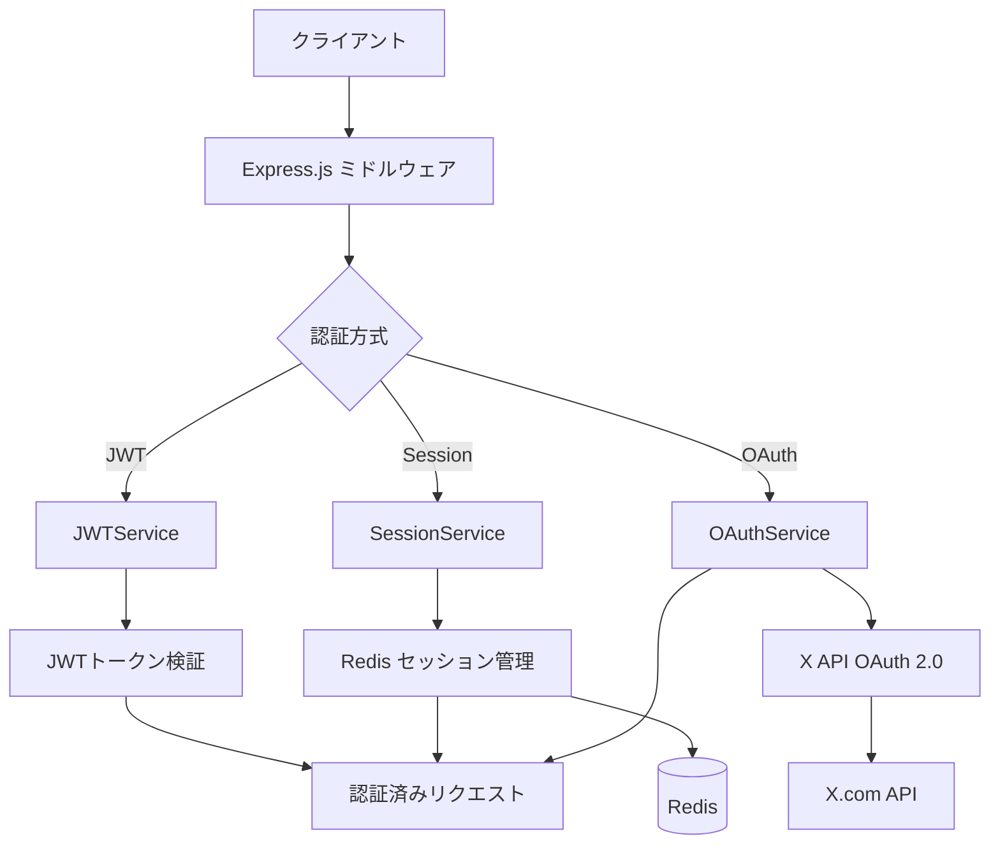
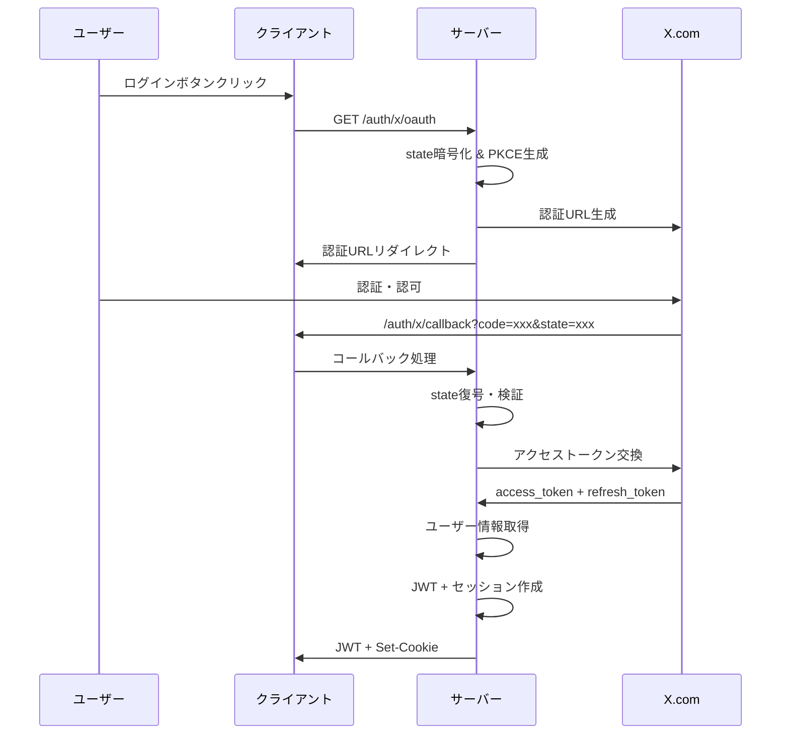

# X Bookmarker 認証システム アーキテクチャガイド

このドキュメントでは、X Bookmarkerの認証システムの設計思想と全体的なアーキテクチャについて詳しく解説します。

## システム概要

X Bookmarkerの認証システムは、**JWT（JSON Web Token）**と**X OAuth 2.0**、**Redisセッション管理**を組み合わせた、セキュアで拡張性の高い認証アーキテクチャを採用しています。



## なぜこの設計を選んだのか？

### 1. **JWT + セッションハイブリッド方式**

**JWT単体の課題:**
- ログアウト時のトークン無効化が困難
- トークンが漏洩した際の対処が困難
- トークンサイズが大きくなりがち

**セッション単体の課題:**
- サーバー側でのメモリ使用量増加
- 水平スケーリング時の共有が複雑

**ハイブリッド方式の利点:**
```typescript
// JWTで基本認証、セッションで状態管理
const authFlow = {
  jwt: "短期間（15分）、ステートレス認証",
  session: "長期間（7日）、状態管理とアクセス制御",
  refresh: "トークン自動更新による UX 向上"
};
```

### 2. **X OAuth 2.0統合の理由**

X（旧Twitter）のブックマーク機能と連携するため、OAuth 2.0による認証が必要不可欠です：

- **PKCE (Proof Key for Code Exchange)**: セキュアな認証フロー
- **スコープ制限**: 必要最小限の権限のみ要求
- **リフレッシュトークン**: 長期間のアクセス維持

## 認証フローの詳細

### 1. OAuth認証フロー



### 2. JWT認証フロー

```typescript
// 実際の認証処理
const authenticateJWT = async (req: Request, res: Response, next: NextFunction) => {
  // 1. Authorization ヘッダーからトークン抽出
  const token = req.headers.authorization?.split(' ')[1];
  
  // 2. JWT検証（署名・有効期限・発行者）
  const payload = jwtService.verifyToken(token);
  
  // 3. リクエストにユーザー情報を追加
  req.user = payload;
  next();
};
```

## 主要コンポーネントの役割

### 1. JWTService - トークン管理の中核

```typescript
class JWTService {
  // アクセストークン（短期間・15分）
  generateAccessToken(payload): string
  
  // リフレッシュトークン（長期間・7日）
  generateRefreshToken(payload): string
  
  // トークン検証（署名・有効期限・構造）
  verifyToken(token): JWTPayload
  
  // デコード（検証なし・デバッグ用）
  decodeToken(token): JWTPayload | null
}
```

**設計のポイント:**
- **短期アクセストークン**: セキュリティ向上のため15分で期限切れ
- **長期リフレッシュトークン**: UX向上のため7日間有効
- **issuer/audience検証**: トークンの発行元・対象を厳密にチェック

### 2. OAuthService - X API統合

```typescript
class OAuthService {
  // PKCE対応の認証URL生成
  generateAuthUrl(redirectUrl): string
  
  // 認証コードからトークン取得
  exchangeCodeForToken(code, state): Promise<TokenResponse>
  
  // リフレッシュトークンでアクセストークン更新
  refreshToken(refreshToken): Promise<TokenResponse>
  
  // ユーザー情報取得
  getUserInfo(accessToken): Promise<XUserInfo>
}
```

**セキュリティ機能:**
- **State暗号化**: CSRF攻撃防止のため、stateパラメータを暗号化
- **PKCE実装**: 認証コード横取り攻撃を防止
- **有効期限チェック**: State の有効期限（10分）を厳密に管理

### 3. SessionService - Redis セッション管理

```typescript
class SessionService {
  // セッション作成（有効期限付き）
  createSession(sessionId, data): Promise<void>
  
  // セッション取得・最終アクセス時間更新
  getSession(sessionId): Promise<SessionData | null>
  
  // セッション更新
  updateSession(sessionId, data): Promise<void>
  
  // セッション削除・一括削除
  deleteSession(sessionId): Promise<void>
  deleteUserSessions(userId): Promise<void>
}
```

**Redis活用の利点:**
- **高速アクセス**: インメモリデータベースによる高速セッション管理
- **自動期限切れ**: Redis の TTL 機能でセッション自動削除
- **スケーラビリティ**: 複数サーバー間でのセッション共有

## 認証ミドルウェアの階層構造

### 1. 基本認証ミドルウェア

```typescript
// JWT必須認証
authenticateJWT: 'すべてのAPIアクセスに必要'

// セッション認証
authenticateSession: 'Cookie ベースの Web アプリ用'

// オプション認証
optionalAuth: '認証があれば使用、なくても通す'
```

### 2. アクセス制御ミドルウェア

```typescript
// ロールベースアクセス制御（将来拡張用）
requireRole(['admin', 'user']): 'ユーザー権限による制限'

// リソース所有者チェック
requireOwnership('userId'): 'ユーザーが自分のデータのみアクセス可能'

// 自動トークンリフレッシュ
autoRefreshToken: 'トークン期限切れ前に自動更新示唆'
```

## セキュリティ対策の実装

### 1. **CSRF（Cross-Site Request Forgery）対策**

```typescript
// OAuth State パラメータの暗号化
const encryptState = (state: OAuthState): string => {
  const iv = crypto.randomBytes(16);
  const cipher = crypto.createCipher('aes-256-cbc', encryptionKey);
  // ... 暗号化処理
  return encrypted;
};
```

### 2. **JWT セキュリティ強化**

```typescript
const jwtConfig = {
  // 強力な秘密鍵（最低32文字）
  secret: process.env.JWT_SECRET,
  
  // 発行者・対象者検証
  issuer: 'x-bookmarker',
  audience: 'x-bookmarker-app',
  
  // 短期間トークン
  accessTokenExpiry: '15m',
  refreshTokenExpiry: '7d'
};
```

### 3. **セッション固定攻撃対策**

```typescript
// セッション作成時に最終アクセス時間を更新
const updateLastActiveTime = async (sessionId: string) => {
  const updatedData = {
    ...existingData,
    lastActiveAt: new Date().toISOString()
  };
  await updateSession(sessionId, updatedData);
};
```

## エラーハンドリング戦略

### 1. **統一されたエラーレスポンス**

```typescript
interface AuthErrorResponse {
  success: false;
  error: string;        // ユーザー向けメッセージ
  code: string;         // エラーコード（フロントエンド処理用）
  details?: unknown;    // 詳細情報（開発環境のみ）
}
```

### 2. **段階的なエラー処理**

```typescript
const errorCodes = {
  // 認証関連
  'MISSING_AUTH_HEADER': '認証ヘッダーが不足',
  'INVALID_TOKEN': 'トークンが無効',
  'TOKEN_EXPIRED': 'トークンが期限切れ',
  
  // OAuth関連
  'OAUTH_STATE_EXPIRED': 'OAuth state が期限切れ',
  'TOKEN_EXCHANGE_FAILED': 'トークン交換に失敗',
  
  // セッション関連
  'SESSION_NOT_FOUND': 'セッションが見つからない',
  'REDIS_CONNECTION_ERROR': 'Redis 接続エラー'
};
```

### 3. **ログ出力とモニタリング**

```typescript
// 構造化ログ出力
console.log('✅ Session created:', { sessionId, userId });
console.error('❌ JWT Authentication Error:', { error, userId, ip });
console.warn('⚠️  Using default encryption key');
```

## パフォーマンス最適化

### 1. **Redis接続プール**

```typescript
const redisClient = createClient({
  url: process.env.REDIS_URL,
  // 接続プール設定
  socket: {
    keepAlive: true,
    reconnectStrategy: (retries) => Math.min(retries * 50, 500)
  }
});
```

### 2. **JWT検証の最適化**

```typescript
// トークンデコードキャッシュ（ローカルメモリ）
const tokenCache = new Map<string, JWTPayload>();

const verifyTokenCached = (token: string): JWTPayload => {
  if (tokenCache.has(token)) {
    return tokenCache.get(token)!;
  }
  
  const payload = jwt.verify(token, secret);
  tokenCache.set(token, payload);
  return payload;
};
```

## 拡張性の考慮

### 1. **マルチテナント対応**

```typescript
interface JWTPayload {
  userId: string;
  xUserId: string;
  username: string;
  // 将来の拡張用
  tenantId?: string;
  roles?: string[];
  permissions?: string[];
}
```

### 2. **認証プロバイダーの追加**

```typescript
// 将来の拡張: Google, GitHub などの OAuth プロバイダー
interface AuthProvider {
  generateAuthUrl(state: string): string;
  exchangeCodeForToken(code: string, state: string): Promise<TokenResponse>;
  getUserInfo(token: string): Promise<UserInfo>;
}

class GoogleOAuthProvider implements AuthProvider { /* ... */ }
class GitHubOAuthProvider implements AuthProvider { /* ... */ }
```

## トラブルシューティング

### よくある問題と解決方法

#### 1. **「JWT_SECRET should be at least 32 characters long」**
```bash
# 解決方法: 強力な秘密鍵を生成
openssl rand -base64 32
# 環境変数に設定
export JWT_SECRET="your-generated-secret-key"
```

#### 2. **「Redis client not connected」**
```typescript
// 解決方法: Redis 接続確認
const healthCheck = async () => {
  try {
    await redisClient.ping();
    console.log('✅ Redis connected');
  } catch (error) {
    console.error('❌ Redis connection failed:', error);
  }
};
```

#### 3. **「OAuth state expired」**
```typescript
// 解決方法: State の有効期限を確認
const isStateValid = (timestamp: number): boolean => {
  const maxAge = 10 * 60 * 1000; // 10分
  return Date.now() - timestamp < maxAge;
};
```

## まとめ

X Bookmarkerの認証システムは、以下の設計原則に基づいて構築されています：

- **セキュリティ第一**: JWT + OAuth 2.0 + PKCE による多層防御
- **ユーザビリティ**: 自動トークンリフレッシュによるシームレスな体験
- **スケーラビリティ**: Redis によるセッション管理と水平スケーリング対応
- **拡張性**: マルチプロバイダー対応とロールベースアクセス制御の基盤

このアーキテクチャにより、安全で使いやすく、将来の要件変更にも柔軟に対応できる認証システムを実現しています。

---

> 💡 **次のステップ**: [認証システム実装ガイド](./auth-guide.md)で具体的な実装方法を学習してください。