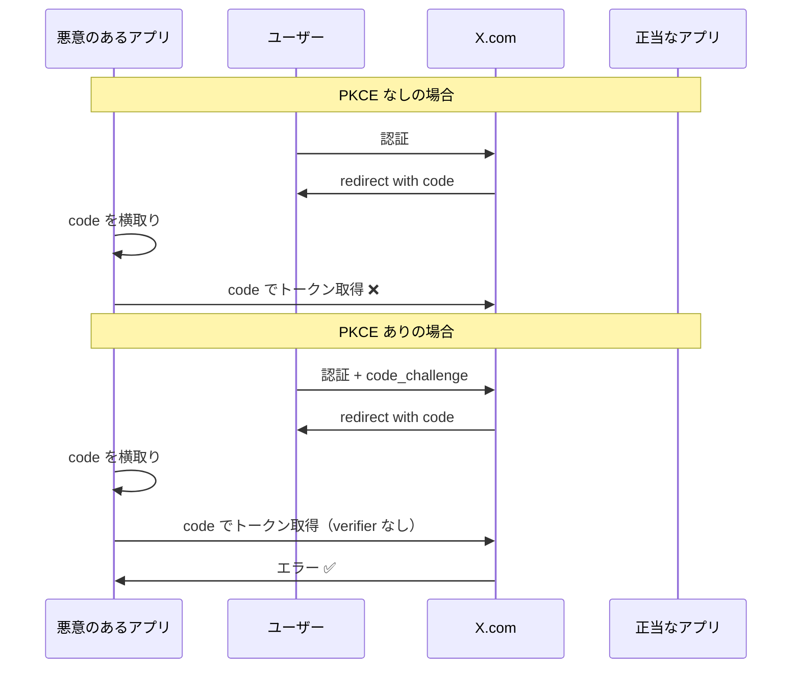

# X Bookmarker 認証システム実装ガイド

このドキュメントでは、X Bookmarkerの認証システムの各コンポーネントの実装詳細について、コード例とともに詳しく解説します。

## JWTService - JSON Web Token 管理

JWTServiceは、アクセストークンとリフレッシュトークンの生成・検証を担当するサービスクラスです。

### 基本的な設計パターン

```typescript
class JWTService {
  private config: JWTConfig;

  constructor() {
    this.config = {
      secret: process.env.JWT_SECRET || 'fallback-key',
      accessTokenExpiry: process.env.JWT_ACCESS_EXPIRY || '15m',
      refreshTokenExpiry: process.env.JWT_REFRESH_EXPIRY || '7d',
    };
    
    this.validateConfig();
  }
}
```

**なぜこの設計？**

#### 1. **設定の一元管理**
```typescript
private config: JWTConfig;
```
設定を一箇所で管理することで、環境変数の変更が容易になり、テスト時のモック化も簡単になります。

#### 2. **環境変数のフォールバック**
```typescript
secret: process.env.JWT_SECRET || 'fallback-key'
```
本番環境では適切な秘密鍵が必要ですが、開発環境での動作も保証します。

### generateTokens()メソッドの実装詳細

```typescript
generateTokens(payload: Omit<JWTPayload, 'iat' | 'exp'>): {
  accessToken: string;
  refreshToken: string;
  expiresAt: Date;
} {
  const accessToken = this.generateAccessToken(payload);
  const refreshToken = this.generateRefreshToken(payload);
  
  // アクセストークンの有効期限を計算
  const expiresAt = new Date();
  const expiryMs = this.parseExpiryToMs(this.config.accessTokenExpiry);
  expiresAt.setTime(expiresAt.getTime() + expiryMs);

  return { accessToken, refreshToken, expiresAt };
}
```

**実装のポイント:**

#### 1. **型安全性の確保**
```typescript
payload: Omit<JWTPayload, 'iat' | 'exp'>
```
`iat`（issued at）と`exp`（expiration）は自動生成されるため、TypeScriptの`Omit`型でペイロードから除外しています。

#### 2. **有効期限の正確な計算**
```typescript
const parseExpiryToMs = (expiry: string): number => {
  const regex = /^(\d+)([smhd])$/;
  const match = expiry.match(regex);
  
  const multipliers = {
    s: 1000,                    // 秒
    m: 60 * 1000,              // 分
    h: 60 * 60 * 1000,         // 時間
    d: 24 * 60 * 60 * 1000,    // 日
  };

  return value * multipliers[unit];
};
```

この実装により、`'15m'`、`'7d'`のような人間が読みやすい形式で有効期限を指定できます。

### verifyToken()メソッドの高度なエラーハンドリング

```typescript
verifyToken(token: string): JWTPayload {
  try {
    const decoded = jwt.verify(token, this.config.secret, {
      issuer: 'x-bookmarker',
      audience: 'x-bookmarker-app',
    });

    // Zodスキーマでペイロード構造を検証
    const result = JWTPayloadSchema.safeParse(decoded);
    if (!result.success) {
      throw new Error('Invalid token payload structure');
    }

    return result.data;
  } catch (error) {
    // 特定のJWTエラーを詳細に分類
    if (error instanceof jwt.JsonWebTokenError) {
      throw new Error('Invalid token');
    }
    if (error instanceof jwt.TokenExpiredError) {
      throw new Error('Token expired');
    }
    if (error instanceof jwt.NotBeforeError) {
      throw new Error('Token not active');
    }
    throw error;
  }
}
```

**エラーハンドリングの利点:**

#### 1. **段階的な検証**
1. JWT署名と有効期限の検証
2. 発行者（issuer）と対象者（audience）の検証
3. ペイロード構造のスキーマ検証

#### 2. **詳細なエラー分類**
```typescript
const errorMapping = {
  JsonWebTokenError: 'トークンの署名が無効',
  TokenExpiredError: 'トークンの有効期限切れ',
  NotBeforeError: 'トークンがまだ有効ではない'
};
```

フロントエンドでエラーの種類に応じた適切な処理が可能になります。

## OAuthService - X API OAuth 2.0 統合

OAuthServiceは、X（旧Twitter）APIとのOAuth 2.0認証フローを管理します。

### PKCE（Proof Key for Code Exchange）の実装

```typescript
private generateCodeChallenge(): string {
  const codeVerifier = crypto.randomBytes(32).toString('base64url');
  // 注意: 本番環境ではRedisに保存すべき
  process.env._CODE_VERIFIER = codeVerifier;
  
  return crypto
    .createHash('sha256')
    .update(codeVerifier)
    .digest('base64url');
}

private getCodeVerifier(): string {
  const codeVerifier = process.env._CODE_VERIFIER;
  if (!codeVerifier) {
    throw new Error('Code verifier not found');
  }
  return codeVerifier;
}
```

**PKCEが必要な理由:**

#### 1. **認証コード横取り攻撃の防止**


#### 2. **実装上の考慮事項**
```typescript
// 現在の実装（開発用）
process.env._CODE_VERIFIER = codeVerifier;

// 本番環境推奨実装
await redisClient.setEx(`pkce:${sessionId}`, 600, codeVerifier); // 10分で期限切れ
```

### OAuth State の暗号化実装

```typescript
private encryptState(state: OAuthState): string {
  const validationResult = OAuthStateSchema.safeParse(state);
  if (!validationResult.success) {
    throw new Error('Invalid OAuth state data');
  }

  const iv = crypto.randomBytes(16);
  const cipher = crypto.createCipher('aes-256-cbc', this.config.encryptionKey);
  
  let encrypted = cipher.update(JSON.stringify(validationResult.data), 'utf8', 'hex');
  encrypted += cipher.final('hex');
  
  return Buffer.from(iv.toString('hex') + ':' + encrypted).toString('base64');
}
```

**State暗号化の目的:**

#### 1. **CSRF攻撃の防止**
```typescript
interface OAuthState {
  redirectUrl: string;    // 認証後のリダイレクト先
  timestamp: number;      // リプレイ攻撃防止用
  nonce: string;         // 一意性保証
}
```

#### 2. **リプレイ攻撃の防止**
```typescript
const isStateValid = (stateData: OAuthState): boolean => {
  const maxAge = 10 * 60 * 1000; // 10分
  return Date.now() - stateData.timestamp < maxAge;
};
```

### exchangeCodeForToken()の堅牢な実装

```typescript
async exchangeCodeForToken(code: string, state: string): Promise<{
  tokenResponse: XTokenResponse;
  stateData: OAuthState;
}> {
  // 1. State の復号と検証
  const stateData = this.decryptState(state);
  
  // 2. タイムスタンプ検証
  if (Date.now() - stateData.timestamp > 10 * 60 * 1000) {
    throw new Error('OAuth state expired');
  }

  const codeVerifier = this.getCodeVerifier();

  // 3. X APIへのトークン交換リクエスト
  try {
    const response = await axios.post(this.TOKEN_URL, {
      grant_type: 'authorization_code',
      client_id: this.config.clientId,
      client_secret: this.config.clientSecret,
      code,
      redirect_uri: this.config.redirectUri,
      code_verifier: codeVerifier,
    }, {
      headers: { 'Content-Type': 'application/x-www-form-urlencoded' },
    });

    // 4. レスポンスの検証
    const validationResult = XTokenResponseSchema.safeParse(response.data);
    if (!validationResult.success) {
      throw new Error('Invalid token response format');
    }

    return { tokenResponse: validationResult.data, stateData };
  } catch (error) {
    // 5. エラーハンドリング
    if (axios.isAxiosError(error)) {
      console.error('❌ X API Token Exchange Error:', error.response?.data);
      throw new Error(`Token exchange failed: ${error.response?.data?.error_description || error.message}`);
    }
    throw error;
  }
}
```

**実装の特徴:**

#### 1. **多段階の検証**
1. State の復号化
2. タイムスタンプ検証（リプレイ攻撃防止）
3. X APIレスポンスの構造検証
4. エラーハンドリング

#### 2. **詳細なログ出力**
```typescript
console.error('❌ X API Token Exchange Error:', error.response?.data);
```
デバッグ時とモニタリングに重要な情報を提供します。

## SessionService - Redis セッション管理

SessionServiceは、Redisを使用したセッション管理機能を提供します。

### Redis接続管理の実装

```typescript
private async setupRedisClient(): Promise<void> {
  this.client.on('error', (error) => {
    console.error('❌ Redis Client Error:', error);
    this.isConnected = false;
  });

  this.client.on('connect', () => {
    console.log('🔗 Redis Client Connected');
    this.isConnected = true;
  });

  this.client.on('disconnect', () => {
    console.log('🔌 Redis Client Disconnected');
    this.isConnected = false;
  });

  try {
    await this.client.connect();
  } catch (error) {
    console.error('❌ Failed to connect to Redis:', error);
  }
}
```

**接続管理の重要性:**

#### 1. **接続状態の監視**
```typescript
private isConnected: boolean = false;

// すべてのメソッドで接続状態をチェック
if (!this.isConnected) {
  throw new Error('Redis client not connected');
}
```

#### 2. **自動再接続とエラーハンドリング**
```typescript
const redisClient = createClient({
  url: this.config.redisUrl,
  socket: {
    reconnectStrategy: (retries) => Math.min(retries * 50, 500)
  }
});
```

### getSession()の最適化された実装

```typescript
async getSession(sessionId: string): Promise<SessionData | null> {
  if (!this.isConnected) {
    throw new Error('Redis client not connected');
  }

  const key = `${this.config.sessionPrefix}${sessionId}`;
  const data = await this.client.get(key);

  if (!data) {
    return null;
  }

  try {
    const parsedData = JSON.parse(data);
    const validationResult = SessionDataSchema.safeParse(parsedData);
    
    if (!validationResult.success) {
      console.error('❌ Invalid session data format, removing session:', sessionId);
      await this.deleteSession(sessionId);
      return null;
    }

    // 最終アクセス時間の自動更新
    const updatedData = {
      ...validationResult.data,
      lastActiveAt: new Date().toISOString(),
    };

    await this.updateSession(sessionId, updatedData);
    return updatedData;
  } catch (error) {
    console.error('❌ Error parsing session data:', error);
    await this.deleteSession(sessionId);
    return null;
  }
}
```

**最適化のポイント:**

#### 1. **自動データ修復**
```typescript
if (!validationResult.success) {
  await this.deleteSession(sessionId); // 破損したセッションを自動削除
  return null;
}
```

#### 2. **最終アクセス時間の自動更新**
```typescript
const updatedData = {
  ...validationResult.data,
  lastActiveAt: new Date().toISOString(),
};
```

セッションアクセスのたびに最終アクセス時間を更新し、アクティブなセッションを追跡できます。

### getUserSessions()の効率的な実装

```typescript
async getUserSessions(userId: string): Promise<{ sessionId: string; data: SessionData }[]> {
  if (!this.isConnected) {
    throw new Error('Redis client not connected');
  }

  const pattern = `${this.config.sessionPrefix}*`;
  const keys = await this.client.keys(pattern);
  const sessions: { sessionId: string; data: SessionData }[] = [];

  for (const key of keys) {
    const data = await this.client.get(key);
    if (data) {
      try {
        const parsedData = JSON.parse(data);
        if (parsedData.userId === userId) {
          const sessionId = key.replace(this.config.sessionPrefix, '');
          sessions.push({ sessionId, data: parsedData });
        }
      } catch (error) {
        console.error('❌ Error parsing session data for key:', key);
      }
    }
  }

  return sessions;
}
```

**パフォーマンス上の注意:**

#### 1. **KEYS コマンドの制限**
```typescript
// 現在の実装（小規模システム用）
const keys = await this.client.keys(pattern);

// 大規模システム推奨実装
const keys = [];
for await (const key of this.client.scanIterator({ MATCH: pattern })) {
  keys.push(key);
}
```

#### 2. **バッチ処理の最適化**
```typescript
// 並列処理による高速化
const sessionPromises = keys.map(async (key) => {
  const data = await this.client.get(key);
  return { key, data };
});

const results = await Promise.all(sessionPromises);
```

## 認証ミドルウェアの実装

### authenticateJWT ミドルウェア

```typescript
export const authenticateJWT = async (
  req: Request,
  res: Response,
  next: NextFunction
): Promise<void> => {
  try {
    const authHeader = req.headers.authorization;
    
    if (!authHeader) {
      res.status(401).json({
        success: false,
        error: 'Authorization header required',
        code: 'MISSING_AUTH_HEADER',
      });
      return;
    }

    const token = authHeader.split(' ')[1]; // 'Bearer ' を除去
    
    if (!token) {
      res.status(401).json({
        success: false,
        error: 'Bearer token required',
        code: 'MISSING_TOKEN',
      });
      return;
    }

    try {
      const payload = jwtService.verifyToken(token);
      req.user = payload;
      next();
    } catch (error) {
      // エラーメッセージの詳細な分類
      let errorCode = 'INVALID_TOKEN';
      let errorMessage = 'Invalid token';

      if (error instanceof Error) {
        if (error.message === 'Token expired') {
          errorCode = 'TOKEN_EXPIRED';
          errorMessage = 'Token expired';
        } else if (error.message === 'Token not active') {
          errorCode = 'TOKEN_NOT_ACTIVE';
          errorMessage = 'Token not active';
        }
      }

      res.status(401).json({
        success: false,
        error: errorMessage,
        code: errorCode,
      });
      return;
    }
  } catch (error) {
    console.error('❌ JWT Authentication Error:', error);
    res.status(500).json({
      success: false,
      error: 'Internal server error',
      code: 'INTERNAL_ERROR',
    });
  }
};
```

**ミドルウェア設計の原則:**

#### 1. **統一されたエラーレスポンス**
```typescript
interface AuthErrorResponse {
  success: false;
  error: string;    // ユーザー向けメッセージ
  code: string;     // フロントエンド処理用コード
}
```

#### 2. **Express型拡張**
```typescript
declare global {
  namespace Express {
    interface Request {
      user?: JWTPayload;
      sessionId?: string;
    }
  }
}
```

TypeScript での型安全性を保ちながら、Express の Request オブジェクトにユーザー情報を追加します。

### requireOwnership ミドルウェア

```typescript
export const requireOwnership = (userIdParam: string = 'userId') => {
  return (req: Request, res: Response, next: NextFunction): void => {
    if (!req.user) {
      res.status(401).json({
        success: false,
        error: 'Authentication required',
        code: 'AUTHENTICATION_REQUIRED',
      });
      return;
    }

    const resourceUserId = req.params[userIdParam];
    
    if (resourceUserId && resourceUserId !== req.user.userId) {
      res.status(403).json({
        success: false,
        error: 'Access denied',
        code: 'ACCESS_DENIED',
      });
      return;
    }

    next();
  };
};
```

**使用例:**
```typescript
// ユーザーが自分のブックマークのみアクセス可能
router.get('/users/:userId/bookmarks', 
  authenticateJWT, 
  requireOwnership('userId'), 
  getBookmarks
);
```

### autoRefreshToken ミドルウェア

```typescript
export const autoRefreshToken = async (
  req: Request,
  res: Response,
  next: NextFunction
): Promise<void> => {
  if (!req.user) {
    next();
    return;
  }

  try {
    const tokenExpiry = new Date(req.user.exp * 1000);
    const now = new Date();
    const timeUntilExpiry = tokenExpiry.getTime() - now.getTime();
    
    // トークンが5分以内に期限切れになる場合、リフレッシュを示唆
    if (timeUntilExpiry < 5 * 60 * 1000) {
      res.setHeader('X-Token-Refresh-Needed', 'true');
    }
  } catch (error) {
    console.log('⚠️  Token refresh check failed:', error);
  }
  
  next();
};
```

**フロントエンドでの活用例:**
```typescript
// APIレスポンスヘッダーをチェック
const response = await fetch('/api/bookmarks', {
  headers: { 'Authorization': `Bearer ${token}` }
});

if (response.headers.get('X-Token-Refresh-Needed') === 'true') {
  // バックグラウンドでトークンをリフレッシュ
  await refreshAccessToken();
}
```

## テストの実装

### JWTService のユニットテスト

```typescript
describe('JWTService', () => {
  let jwtService: JWTService;

  beforeEach(() => {
    jwtService = new JWTService();
  });

  describe('generateTokens', () => {
    it('should generate valid access and refresh tokens', () => {
      const payload = {
        userId: 'user-123',
        xUserId: 'x-456',
        username: 'testuser'
      };

      const result = jwtService.generateTokens(payload);

      expect(result.accessToken).toBeDefined();
      expect(result.refreshToken).toBeDefined();
      expect(result.expiresAt).toBeInstanceOf(Date);

      // アクセストークンの検証
      const decodedAccess = jwtService.verifyToken(result.accessToken);
      expect(decodedAccess.userId).toBe(payload.userId);
    });
  });

  describe('verifyToken', () => {
    it('should verify valid token', () => {
      const payload = { userId: 'user-123', xUserId: 'x-456', username: 'test' };
      const token = jwtService.generateAccessToken(payload);

      const decoded = jwtService.verifyToken(token);
      expect(decoded.userId).toBe(payload.userId);
    });

    it('should throw error for expired token', () => {
      // 期限切れトークンのテスト
      const expiredToken = jwt.sign(
        { userId: 'user-123' },
        'secret',
        { expiresIn: '-1h' } // 1時間前に期限切れ
      );

      expect(() => jwtService.verifyToken(expiredToken))
        .toThrow('Token expired');
    });
  });
});
```

### OAuthService の統合テスト

```typescript
describe('OAuthService', () => {
  let oauthService: OAuthService;
  
  beforeEach(() => {
    oauthService = new OAuthService();
  });

  describe('generateAuthUrl', () => {
    it('should generate valid OAuth URL', () => {
      const redirectUrl = '/dashboard';
      const authUrl = oauthService.generateAuthUrl(redirectUrl);

      expect(authUrl).toContain('https://twitter.com/i/oauth2/authorize');
      expect(authUrl).toContain('client_id=');
      expect(authUrl).toContain('code_challenge=');
      expect(authUrl).toContain('state=');
    });
  });

  describe('exchangeCodeForToken', () => {
    it('should exchange code for token', async () => {
      // モックレスポンス
      const mockTokenResponse = {
        access_token: 'mock_access_token',
        refresh_token: 'mock_refresh_token',
        expires_in: 3600,
        token_type: 'bearer'
      };

      jest.spyOn(axios, 'post').mockResolvedValue({
        data: mockTokenResponse
      });

      const result = await oauthService.exchangeCodeForToken('code', 'state');
      
      expect(result.tokenResponse.access_token).toBe(mockTokenResponse.access_token);
    });
  });
});
```

## デプロイメントとセキュリティ設定

### 環境変数の設定

```bash
# JWT設定
JWT_SECRET="your-super-secure-secret-key-32-chars-minimum"
JWT_ACCESS_EXPIRY="15m"
JWT_REFRESH_EXPIRY="7d"

# X OAuth設定
X_CLIENT_ID="your-x-client-id"
X_CLIENT_SECRET="your-x-client-secret"
X_REDIRECT_URI="https://yourdomain.com/auth/x/callback"

# OAuth暗号化キー
OAUTH_ENCRYPTION_KEY="your-oauth-encryption-key-32-chars"

# Redis設定
REDIS_URL="redis://localhost:6379"
SESSION_TIMEOUT="3600"

# セキュリティ設定
NODE_ENV="production"
```

### Nginx 設定例

```nginx
server {
    listen 443 ssl;
    server_name yourdomain.com;

    # SSL証明書設定
    ssl_certificate /path/to/certificate.crt;
    ssl_certificate_key /path/to/private.key;

    location /api/ {
        proxy_pass http://localhost:3001;
        proxy_set_header Host $host;
        proxy_set_header X-Real-IP $remote_addr;
        proxy_set_header X-Forwarded-For $proxy_add_x_forwarded_for;
        proxy_set_header X-Forwarded-Proto $scheme;
        
        # セキュリティヘッダー
        add_header X-Frame-Options DENY;
        add_header X-Content-Type-Options nosniff;
        add_header X-XSS-Protection "1; mode=block";
    }
}
```

## まとめ

X Bookmarkerの認証システムは、以下の特徴を持つ実装になっています：

- **JWT + セッションハイブリッド**: 短期JWT + 長期セッションによる最適なUX
- **OAuth 2.0 + PKCE**: X APIとの安全な連携
- **Redis セッション管理**: 高速でスケーラブルなセッション処理
- **多層的セキュリティ**: 暗号化、検証、エラーハンドリングの組み合わせ
- **型安全性**: TypeScript + Zod による堅牢なデータ検証

この実装により、セキュアで保守性が高く、将来の拡張にも対応できる認証システムが構築できています。

---

> 💡 **関連ドキュメント**: 
> - [認証システムアーキテクチャ](./auth-architecture.md)
> - [ミドルウェアガイド](./middleware-guide.md)