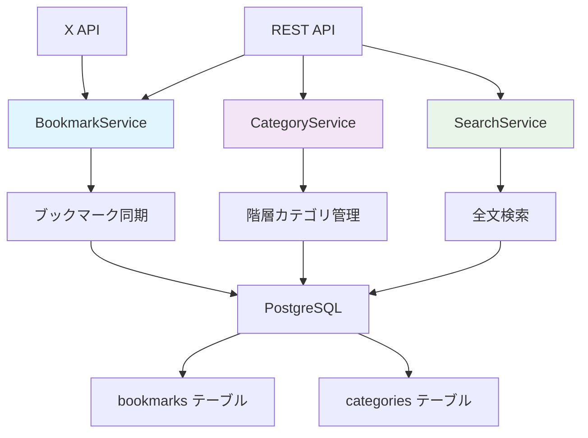
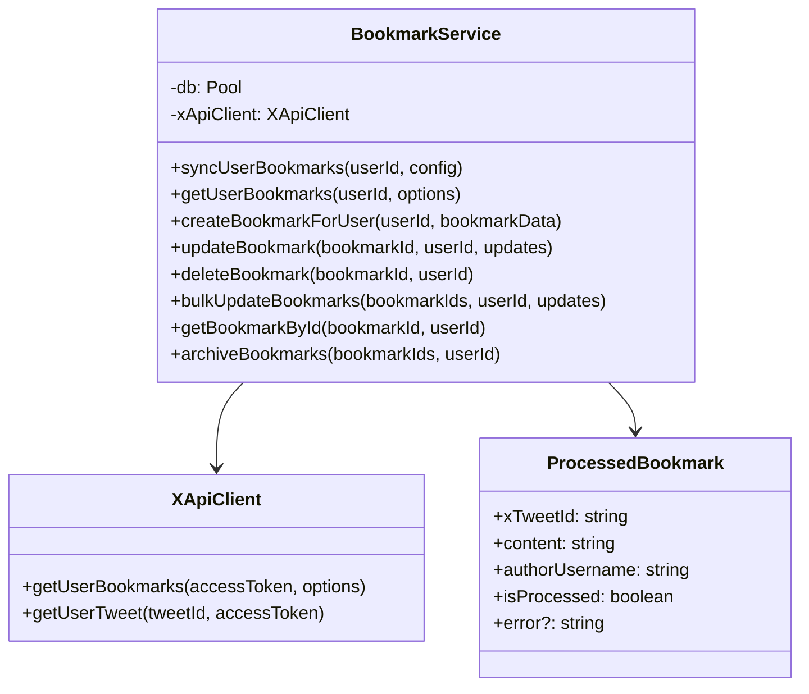
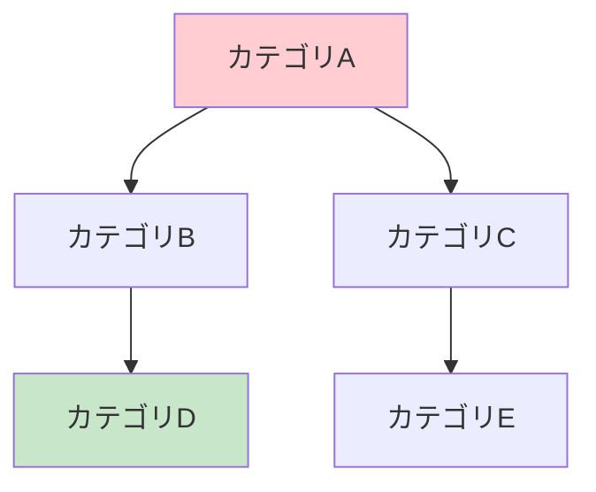

# X Bookmarker ブックマーク管理システム アーキテクチャガイド

このドキュメントでは、X Bookmarkerのブックマーク管理システムの設計思想とアーキテクチャについて詳しく解説します。

## システム概要

X Bookmarkerのブックマーク管理システムは、**ブックマーク**と**カテゴリ**を中心とした柔軟で拡張性の高いデータ管理システムです。以下の特徴を持っています：

- **階層カテゴリ管理**: 無制限の階層構造でのカテゴリ整理
- **高速検索**: PostgreSQL全文検索による瞬時のブックマーク検索
- **タグシステム**: 柔軟なメタデータ管理とクロス分類
- **X API統合**: リアルタイムでのブックマーク同期
- **一括操作**: 効率的な大量データ処理



## なぜこの設計を選んだのか？

### 1. **サービス層による責務分離**

```typescript
class BookmarkService {
  // ブックマークのCRUD操作
  // X API統合
  // 同期処理
}

class CategoryService {
  // カテゴリの階層管理
  // 循環参照チェック
  // デフォルトカテゴリ管理
}

class SearchService {
  // 全文検索
  // ファセット検索
  // 検索履歴管理
}
```

**設計原則:**
- **単一責任原則**: 各サービスが特定の機能領域を担当
- **疎結合**: サービス間の依存関係を最小化
- **テスタビリティ**: 各サービスを独立してテスト可能

### 2. **依存性注入による柔軟性**

```typescript
class BookmarkService {
  constructor(
    private db: Pool,           // データベース接続
    private xApiClient: XApiClient  // X API クライアント
  ) {}
}
```

**利点:**
- **テスト容易性**: モックオブジェクトを注入してテスト実行
- **設定柔軟性**: 環境ごとに異なる実装を注入可能
- **拡張性**: 新しい依存関係を簡単に追加

### 3. **型安全性の徹底**

```typescript
interface ProcessedBookmark {
  xTweetId: string;
  content: string;
  authorUsername: string;
  authorDisplayName: string;
  authorAvatarUrl?: string;
  mediaUrls: string[];
  links: string[];
  hashtags: string[];
  mentions: string[];
  bookmarkedAt: Date;
  isProcessed: boolean;
  error?: string;
}
```

## BookmarkService - ブックマーク管理の中核

### 1. 設計思想とアーキテクチャ

BookmarkServiceは、以下の責務を持つ中心的なサービスクラスです：



### 2. 非同期ジェネレータによる同期処理

```typescript
async *syncUserBookmarks(
  userId: string,
  config: SyncJobConfig
): AsyncGenerator<SyncJobStatus, SyncJobResult, unknown> {
  let processedCount = 0;
  let totalBookmarks = 0;
  const stats: BookmarkSyncStats = {
    tweetsProcessed: 0,
    bookmarksAdded: 0,
    bookmarksUpdated: 0,
    bookmarksSkipped: 0,
    errors: 0
  };

  try {
    // 1. ユーザーのトークン取得
    const userResult = await this.db.query(
      'SELECT access_token, refresh_token FROM users WHERE id = $1',
      [userId]
    );

    // 2. X APIからブックマーク取得（ページネーション対応）
    let nextToken: string | undefined;
    
    do {
      const response = await this.xApiClient.getUserBookmarks(
        userResult.rows[0].access_token,
        { pagination_token: nextToken, max_results: config.batchSize || 100 }
      );

      // 3. 進捗状況をyield
      yield {
        status: 'processing',
        progress: Math.min(processedCount / (totalBookmarks || 1) * 100, 99),
        message: `${processedCount} bookmarks processed`,
        stats
      };

      // 4. ブックマーク処理
      for (const tweet of response.data) {
        try {
          const processedBookmark = await this.processBookmark(tweet);
          const result = await this.saveBookmark(userId, processedBookmark);
          
          if (result.isNew) {
            stats.bookmarksAdded++;
          } else {
            stats.bookmarksUpdated++;
          }
          
          processedCount++;
        } catch (error) {
          stats.errors++;
          console.error(`❌ Error processing bookmark ${tweet.id}:`, error);
        }
      }

      nextToken = response.meta?.next_token;
      
    } while (nextToken && !config.stopOnError);

    // 5. 完了状態を返す
    return {
      success: true,
      stats,
      message: `Sync completed: ${stats.bookmarksAdded} added, ${stats.bookmarksUpdated} updated`
    };

  } catch (error) {
    yield {
      status: 'error',
      progress: 0,
      message: error instanceof Error ? error.message : 'Sync failed',
      stats
    };
    
    return {
      success: false,
      stats,
      error: error instanceof Error ? error.message : 'Unknown error'
    };
  }
}
```

**非同期ジェネレータの利点:**

#### 1. **リアルタイム進捗報告**
```typescript
// クライアント側での使用例
const syncGenerator = bookmarkService.syncUserBookmarks(userId, config);

for await (const status of syncGenerator) {
  console.log(`Progress: ${status.progress}% - ${status.message}`);
  
  // WebSocketでフロントエンドに進捗を送信
  websocket.send(JSON.stringify(status));
}
```

#### 2. **メモリ効率**
- **ストリーミング処理**: 大量データを少しずつ処理
- **メモリ使用量制限**: 一度に全データをメモリに読み込まない
- **レスポンシブ**: 他の処理をブロックしない

#### 3. **エラーハンドリングの柔軟性**
```typescript
// 部分的な失敗でも処理を継続
try {
  const processedBookmark = await this.processBookmark(tweet);
  stats.bookmarksAdded++;
} catch (error) {
  stats.errors++;
  // エラーログを記録するが処理は継続
  console.error(`❌ Error processing bookmark:`, error);
}
```

### 3. ブックマーク処理とデータ変換

```typescript
private async processBookmark(tweet: XTweet): Promise<ProcessedBookmark> {
  try {
    return {
      xTweetId: tweet.id,
      content: tweet.text,
      authorUsername: tweet.author.username,
      authorDisplayName: tweet.author.name,
      authorAvatarUrl: tweet.author.profile_image_url,
      
      // メディアURL抽出
      mediaUrls: tweet.attachments?.media_keys?.map(key => 
        tweet.includes?.media?.find(media => media.media_key === key)?.url
      ).filter(Boolean) || [],
      
      // リンク抽出
      links: tweet.entities?.urls?.map(url => url.expanded_url).filter(Boolean) || [],
      
      // ハッシュタグ抽出
      hashtags: tweet.entities?.hashtags?.map(tag => tag.tag) || [],
      
      // メンション抽出
      mentions: tweet.entities?.mentions?.map(mention => mention.username) || [],
      
      bookmarkedAt: new Date(tweet.created_at),
      isProcessed: true
    };
  } catch (error) {
    return {
      xTweetId: tweet.id,
      content: tweet.text || '',
      authorUsername: tweet.author?.username || 'unknown',
      authorDisplayName: tweet.author?.name || 'Unknown User',
      mediaUrls: [],
      links: [],
      hashtags: [],
      mentions: [],
      bookmarkedAt: new Date(),
      isProcessed: false,
      error: error instanceof Error ? error.message : 'Processing failed'
    };
  }
}
```

**データ変換の特徴:**

#### 1. **null安全な処理**
```typescript
mediaUrls: tweet.attachments?.media_keys?.map(/* ... */).filter(Boolean) || []
```
- **オプショナルチェーン**: プロパティの存在を安全にチェック
- **filter(Boolean)**: null/undefined値を除外
- **デフォルト値**: 空配列で初期化

#### 2. **複雑なデータ構造の平坦化**
```typescript
// X APIの複雑な構造からシンプルな配列へ変換
hashtags: tweet.entities?.hashtags?.map(tag => tag.tag) || []
```

#### 3. **エラー耐性**
```typescript
// 処理に失敗してもアプリケーション全体を停止させない
catch (error) {
  return {
    // ... 最小限のデータでオブジェクトを構築
    isProcessed: false,
    error: error.message
  };
}
```

## CategoryService - 階層カテゴリ管理

### 1. 階層構造の設計パターン

CategoryServiceは、**隣接リストモデル**を使用して階層カテゴリを実装しています：

```sql
CREATE TABLE categories (
  id UUID PRIMARY KEY,
  user_id UUID NOT NULL,
  name VARCHAR(255) NOT NULL,
  parent_id UUID REFERENCES categories(id),  -- 自己参照外部キー
  order_index INTEGER NOT NULL DEFAULT 0,
  -- その他のフィールド
);
```

**隣接リストモデルの特徴:**

#### 1. **シンプルな構造**
```typescript
interface CategoryWithCounts {
  id: string;
  name: string;
  parent_id?: string;        // 親カテゴリのID
  children?: CategoryWithCounts[];  // 子カテゴリの配列
}
```

#### 2. **再帰クエリによる階層操作**
```sql
-- 階層構造の全取得
WITH RECURSIVE category_tree AS (
  -- ルートカテゴリ（parent_id IS NULL）
  SELECT id, name, parent_id, 0 as level
  FROM categories 
  WHERE parent_id IS NULL AND user_id = $1
  
  UNION ALL
  
  -- 子カテゴリを再帰的に取得
  SELECT c.id, c.name, c.parent_id, ct.level + 1
  FROM categories c
  INNER JOIN category_tree ct ON c.parent_id = ct.id
  WHERE c.user_id = $1
)
SELECT * FROM category_tree ORDER BY level, name;
```

### 2. 循環参照防止システム

```typescript
private async wouldCreateCircularReference(
  categoryId: string, 
  newParentId: string, 
  userId: string
): Promise<boolean> {
  // 新しい親が現在のカテゴリの子孫かどうかをチェック
  const result = await this.db.query(`
    WITH RECURSIVE descendants AS (
      -- 指定カテゴリの直接の子を取得
      SELECT id, parent_id 
      FROM categories 
      WHERE parent_id = $1 AND user_id = $2
      
      UNION ALL
      
      -- 子の子を再帰的に取得
      SELECT c.id, c.parent_id
      FROM categories c
      INNER JOIN descendants d ON c.parent_id = d.id
      WHERE c.user_id = $2
    )
    SELECT COUNT(*) as count 
    FROM descendants 
    WHERE id = $3
  `, [categoryId, userId, newParentId]);
  
  return parseInt(result.rows[0].count) > 0;
}
```

**循環参照チェックのロジック:**

#### 1. **子孫検索**


カテゴリAの親をカテゴリDに変更しようとした場合：
1. カテゴリAの全子孫（B, C, D, E）を取得
2. 新しい親候補（D）が子孫に含まれるかチェック
3. 含まれる場合は循環参照となるため拒否

#### 2. **即座の循環参照チェック**
```typescript
// 自分自身を親にしようとする場合
if (updates.parentId === categoryId) {
  throw new Error('Category cannot be its own parent');
}
```

### 3. 階層構造の構築アルゴリズム

```typescript
async getUserCategories(userId: string): Promise<HierarchicalCategory[]> {
  // 1. 全カテゴリをフラットに取得
  const result = await this.db.query(`
    SELECT c.*, COUNT(b.id) as bookmark_count
    FROM categories c
    LEFT JOIN bookmarks b ON c.id = b.category_id AND b.is_archived = FALSE
    WHERE c.user_id = $1
    GROUP BY c.id
    ORDER BY c."order" ASC, c.created_at ASC
  `, [userId]);

  // 2. Map作成（O(1)でのアクセスのため）
  const categoriesMap = new Map<string, HierarchicalCategory>();
  const rootCategories: HierarchicalCategory[] = [];

  // 3. 第1パス: 全カテゴリをMapに格納
  result.rows.forEach(row => {
    const category: HierarchicalCategory = {
      ...row,
      bookmark_count: parseInt(row.bookmark_count) || 0,
      children: []
    };
    categoriesMap.set(category.id, category);
  });

  // 4. 第2パス: 階層関係を構築
  categoriesMap.forEach(category => {
    if (category.parent_id) {
      const parent = categoriesMap.get(category.parent_id);
      if (parent) {
        parent.children.push(category);
      } else {
        // 孤児カテゴリはルートレベルに配置
        rootCategories.push(category);
      }
    } else {
      rootCategories.push(category);
    }
  });

  return rootCategories;
}
```

**アルゴリズムの効率性:**

#### 1. **時間計算量**: O(n) - 各カテゴリを2回スキャンするのみ
#### 2. **空間計算量**: O(n) - Map格納とコピー作成
#### 3. **データベースアクセス**: 1回のクエリで全データ取得

### 4. デフォルトカテゴリシステム

```typescript
async createDefaultCategories(userId: string): Promise<CategoryWithCounts[]> {
  const defaultCategories = [
    { 
      name: '技術・AI', 
      description: 'テクノロジーとAI関連の情報', 
      color: '#3B82F6', 
      icon: 'cpu', 
      order: 1 
    },
    { 
      name: '趣味・ゲーム', 
      description: '趣味とゲーム関連の情報', 
      color: '#10B981', 
      icon: 'gamepad-2', 
      order: 2 
    },
    // ... その他のデフォルトカテゴリ
  ];

  const createdCategories: CategoryWithCounts[] = [];

  await this.db.query('BEGIN');

  try {
    for (const categoryData of defaultCategories) {
      const result = await this.db.query(`
        INSERT INTO categories (
          user_id, name, description, color, icon, "order", is_default
        )
        VALUES ($1, $2, $3, $4, $5, $6, $7)
        RETURNING *
      `, [
        userId,
        categoryData.name,
        categoryData.description,
        categoryData.color,
        categoryData.icon,
        categoryData.order,
        true  // デフォルトカテゴリフラグ
      ]);

      createdCategories.push(result.rows[0]);
    }

    await this.db.query('COMMIT');
    return createdCategories;
  } catch (error) {
    await this.db.query('ROLLBACK');
    throw error;
  }
}
```

**デフォルトカテゴリの特徴:**

#### 1. **削除防止**
```typescript
// デフォルトカテゴリの削除を防ぐ
if (existingCategory.rows[0].is_default) {
  throw new Error('Cannot delete default category');
}
```

#### 2. **ローカライゼーション対応**
```typescript
const defaultCategories = [
  { name: '技術・AI', description: 'テクノロジーとAI関連の情報' },
  { name: '趣味・ゲーム', description: '趣味とゲーム関連の情報' },
  // 日本語でのカテゴリ名
];
```

## データ操作の最適化パターン

### 1. 一括操作によるパフォーマンス向上

```typescript
async bulkUpdateBookmarks(
  bookmarkIds: string[], 
  userId: string, 
  updates: UpdateBookmark
): Promise<number> {
  // 1. 所有権確認
  const ownershipCheck = await this.db.query(
    'SELECT id FROM bookmarks WHERE id = ANY($1) AND user_id = $2',
    [bookmarkIds, userId]
  );

  if (ownershipCheck.rows.length !== bookmarkIds.length) {
    throw new Error('Some bookmarks do not exist or do not belong to user');
  }

  // 2. 一括更新実行
  const updateEntries = Object.entries(updates).filter(([, value]) => value !== undefined);
  const setClause = updateEntries.map(([field], index) => `${field} = $${index + 3}`).join(', ');
  const values = updateEntries.map(([, value]) => value);

  const result = await this.db.query(`
    UPDATE bookmarks 
    SET ${setClause}, updated_at = NOW()
    WHERE id = ANY($1) AND user_id = $2
    RETURNING id
  `, [bookmarkIds, userId, ...values]);

  return result.rows.length;
}
```

**一括操作の利点:**

#### 1. **データベース負荷軽減**
```sql
-- 非効率なアプローチ（N回のクエリ）
UPDATE bookmarks SET category_id = 'new-cat' WHERE id = 'bookmark1';
UPDATE bookmarks SET category_id = 'new-cat' WHERE id = 'bookmark2';
-- ...

-- 効率的なアプローチ（1回のクエリ）
UPDATE bookmarks 
SET category_id = 'new-cat' 
WHERE id = ANY(ARRAY['bookmark1', 'bookmark2', ...]);
```

#### 2. **トランザクション効率**
- **原子性**: 全ての更新が成功または全て失敗
- **一貫性**: 中間状態が外部から見えない
- **パフォーマンス**: ネットワーク往復の削減

### 2. 条件付きクエリの動的生成

```typescript
private buildBookmarkQuery(filters: BookmarkFilters): {
  query: string;
  params: any[];
} {
  let query = `
    SELECT b.*, c.name as category_name, c.color as category_color
    FROM bookmarks b
    LEFT JOIN categories c ON b.category_id = c.id
    WHERE b.user_id = $1
  `;
  
  const params = [filters.userId];
  let paramIndex = 2;

  // 動的フィルタ追加
  if (filters.categoryId) {
    query += ` AND b.category_id = $${paramIndex}`;
    params.push(filters.categoryId);
    paramIndex++;
  }

  if (filters.tags && filters.tags.length > 0) {
    query += ` AND b.tags && $${paramIndex}`;  // 配列の重複チェック
    params.push(filters.tags);
    paramIndex++;
  }

  if (filters.isArchived !== undefined) {
    query += ` AND b.is_archived = $${paramIndex}`;
    params.push(filters.isArchived);
    paramIndex++;
  }

  // ソート条件
  query += ` ORDER BY b.bookmarked_at DESC`;
  
  // ページネーション
  if (filters.limit) {
    query += ` LIMIT $${paramIndex}`;
    params.push(filters.limit);
    paramIndex++;
  }

  if (filters.offset) {
    query += ` OFFSET $${paramIndex}`;
    params.push(filters.offset);
  }

  return { query, params };
}
```

**動的クエリの利点:**

#### 1. **柔軟性**: 必要な条件のみを追加
#### 2. **パフォーマンス**: 不要な条件による処理時間の無駄を削減
#### 3. **SQLインジェクション防止**: パラメータ化クエリの使用

### 3. インデックス活用による高速化

```sql
-- 効率的なインデックス設計
CREATE INDEX idx_bookmarks_user_category ON bookmarks(user_id, category_id);
CREATE INDEX idx_bookmarks_user_archived ON bookmarks(user_id, is_archived);
CREATE INDEX idx_bookmarks_tags ON bookmarks USING GIN(tags);
CREATE INDEX idx_bookmarks_search_vector ON bookmarks USING GIN(search_vector);

-- 部分インデックス（条件付きインデックス）
CREATE INDEX idx_bookmarks_active 
ON bookmarks(user_id, bookmarked_at DESC) 
WHERE is_archived = FALSE;
```

**インデックス戦略:**

#### 1. **複合インデックス**: よく一緒に使われる条件を組み合わせ
#### 2. **GINインデックス**: 配列と全文検索用
#### 3. **部分インデックス**: 特定条件のレコードのみをインデックス化

## エラーハンドリングとログ戦略

### 1. 階層的エラーハンドリング

```typescript
async createBookmarkForUser(userId: string, bookmarkData: CreateBookmark): Promise<ProcessedBookmark> {
  try {
    // 1. データ検証
    if (!bookmarkData.xTweetId) {
      throw new ValidationError('Tweet ID is required');
    }

    // 2. 重複チェック
    const existingBookmark = await this.db.query(
      'SELECT id FROM bookmarks WHERE user_id = $1 AND x_tweet_id = $2',
      [userId, bookmarkData.xTweetId]
    );

    if (existingBookmark.rows.length > 0) {
      throw new ConflictError('Bookmark already exists for this tweet');
    }

    // 3. ブックマーク作成
    const result = await this.db.query(/* ... */);
    
    return this.formatBookmark(result.rows[0]);
    
  } catch (error) {
    // 4. エラー分類と再スロー
    if (error instanceof ValidationError || error instanceof ConflictError) {
      throw error;  // 既知のエラーはそのまま再スロー
    }
    
    // 5. 未知のエラーは詳細ログ出力
    console.error('❌ Unexpected error creating bookmark:', {
      userId,
      bookmarkData,
      error: error instanceof Error ? error.message : error,
      stack: error instanceof Error ? error.stack : undefined
    });
    
    throw new DatabaseError('Failed to create bookmark');
  }
}
```

### 2. 構造化ログ出力

```typescript
const logBookmarkOperation = (operation: string, data: any, result?: any, error?: Error) => {
  const logEntry = {
    timestamp: new Date().toISOString(),
    operation,
    userId: data.userId,
    bookmarkId: data.bookmarkId,
    success: !error,
    duration: Date.now() - data.startTime,
    error: error ? {
      message: error.message,
      type: error.constructor.name,
      stack: process.env.NODE_ENV === 'development' ? error.stack : undefined
    } : undefined,
    result: result ? {
      recordsAffected: result.recordsAffected,
      newIds: result.newIds
    } : undefined
  };

  if (error) {
    console.error('❌ Bookmark operation failed:', logEntry);
  } else {
    console.log('✅ Bookmark operation completed:', logEntry);
  }
};
```

## パフォーマンス監視と最適化

### 1. クエリ実行時間の計測

```typescript
async getUserBookmarks(userId: string, options: GetBookmarksOptions): Promise<PaginatedBookmarks> {
  const startTime = Date.now();
  
  try {
    const { query, params } = this.buildBookmarkQuery({
      userId,
      ...options
    });
    
    const result = await this.db.query(query, params);
    const executionTime = Date.now() - startTime;
    
    // パフォーマンスログ
    if (executionTime > 1000) {  // 1秒以上の場合
      console.warn('⚠️ Slow query detected:', {
        query: query.substring(0, 200) + '...',
        params: params.slice(0, 5),  // 最初の5パラメータのみ
        executionTime: `${executionTime}ms`,
        resultCount: result.rows.length
      });
    }
    
    return {
      bookmarks: result.rows.map(this.formatBookmark),
      pagination: {
        // ページネーション情報
      },
      executionTime
    };
    
  } catch (error) {
    const executionTime = Date.now() - startTime;
    
    console.error('❌ Query execution failed:', {
      executionTime: `${executionTime}ms`,
      error: error instanceof Error ? error.message : error
    });
    
    throw error;
  }
}
```

### 2. メモリ使用量の最適化

```typescript
async *processLargeBookmarkSet(bookmarkIds: string[]): AsyncGenerator<ProcessedBookmark, void, unknown> {
  // 大量データを小さなバッチに分割して処理
  const BATCH_SIZE = 100;
  
  for (let i = 0; i < bookmarkIds.length; i += BATCH_SIZE) {
    const batch = bookmarkIds.slice(i, i + BATCH_SIZE);
    
    const result = await this.db.query(
      'SELECT * FROM bookmarks WHERE id = ANY($1)',
      [batch]
    );
    
    // 各バッチをyieldして、メモリ使用量を制限
    for (const row of result.rows) {
      yield this.formatBookmark(row);
    }
    
    // バッチ間で短い待機（CPUリソースを他の処理に譲る）
    await new Promise(resolve => setTimeout(resolve, 10));
  }
}
```

## まとめ

X Bookmarkerのブックマーク管理システムは、以下の設計原則に基づいて構築されています：

- **拡張性**: サービス層による疎結合な設計
- **パフォーマンス**: 効率的なクエリとインデックス戦略
- **信頼性**: 包括的なエラーハンドリングとログ出力
- **ユーザビリティ**: 階層カテゴリと柔軟なタグシステム
- **型安全性**: TypeScriptによる堅牢な型定義

このアーキテクチャにより、大量のブックマークデータを効率的に管理し、ユーザーが直感的に情報を整理・検索できるシステムを実現しています。

---

> 💡 **次のステップ**: [ブックマーク実装ガイド](./bookmark-guide.md)で具体的な実装方法を学習してください。