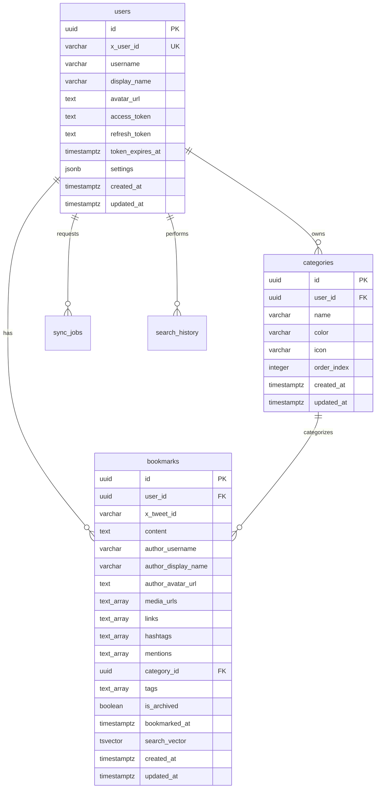

# X Bookmarker データベースアーキテクチャガイド

このドキュメントでは、X Bookmarkerのデータベース設計思想とPostgreSQLを活用したスキーマ設計について詳しく解説します。

## データベース設計の概要

X Bookmarkerは、**PostgreSQL 15以上**を使用し、以下の特徴を持つデータベース設計を採用しています：

- **正規化とパフォーマンスのバランス**: 適切な正規化でデータ整合性を保ちつつ、パフォーマンス重視の非正規化も活用
- **全文検索最適化**: PostgreSQL の tsvector と GIN インデックスによる高速検索
- **JSONB活用**: 柔軟なメタデータ管理とスキーマ進化への対応
- **トリガー活用**: データ整合性とビジネスロジックの自動実行



## なぜPostgreSQLを選んだのか？

### 1. **全文検索機能の優秀性**

PostgreSQLの全文検索は、Elasticsearchなどの専用検索エンジンに匹敵する機能を提供します：

```sql
-- tsvector型による高速全文検索
CREATE INDEX idx_bookmarks_search_vector 
ON bookmarks USING GIN(search_vector);

-- 複数の重み付け検索
SELECT * FROM bookmarks 
WHERE search_vector @@ plainto_tsquery('english_unaccent', 'React TypeScript');
```

### 2. **JSONB型による柔軟性**

ユーザー設定やメタデータを柔軟に格納できます：

```sql
-- ユーザー設定をJSONBで格納
settings JSONB DEFAULT '{}';

-- JSON内のフィールドで検索・更新可能
UPDATE users 
SET settings = settings || '{"theme": "dark"}' 
WHERE id = $1;
```

### 3. **配列型によるタグ管理**

PostgreSQLの配列型により、正規化せずに効率的なタグ管理が可能：

```sql
-- 配列型でタグを格納
tags TEXT[] DEFAULT '{}';

-- GINインデックスで高速検索
CREATE INDEX idx_bookmarks_tags ON bookmarks USING GIN(tags);

-- 配列演算子で効率的なクエリ
SELECT * FROM bookmarks WHERE tags && ARRAY['react', 'javascript'];
```

## テーブル設計の詳細

### 1. users テーブル - ユーザー管理の中核

```sql
CREATE TABLE users (
  id UUID PRIMARY KEY DEFAULT uuid_generate_v4(),
  x_user_id VARCHAR(50) UNIQUE NOT NULL,
  username VARCHAR(255) NOT NULL,
  display_name VARCHAR(255) NOT NULL,
  avatar_url TEXT,
  access_token TEXT NOT NULL,
  refresh_token TEXT NOT NULL,
  token_expires_at TIMESTAMP WITH TIME ZONE NOT NULL,
  settings JSONB DEFAULT '{}',
  created_at TIMESTAMP WITH TIME ZONE DEFAULT NOW(),
  updated_at TIMESTAMP WITH TIME ZONE DEFAULT NOW()
);
```

**設計のポイント:**

#### 1. **UUID主キー**
```sql
id UUID PRIMARY KEY DEFAULT uuid_generate_v4()
```
- **グローバル一意性**: 分散システムでも重複しない
- **セキュリティ**: 連番でないため推測が困難
- **外部API連携**: URLに含めても情報漏洩リスクが低い

#### 2. **X API トークン管理**
```sql
access_token TEXT NOT NULL,
refresh_token TEXT NOT NULL,
token_expires_at TIMESTAMP WITH TIME ZONE NOT NULL
```
- **セキュアなトークン保存**: 暗号化を前提とした設計
- **有効期限管理**: 自動トークンリフレッシュに必要
- **TEXT型使用**: トークン長の変動に対応

#### 3. **柔軟な設定管理**
```sql
settings JSONB DEFAULT '{}'
```

デフォルト設定例：
```json
{
  "theme": "light",
  "viewMode": "grid",
  "autoSync": true,
  "backupEnabled": true,
  "aiSuggestions": true,
  "categories": {
    "defaultColor": "#3B82F6",
    "showCount": true
  },
  "privacy": {
    "shareStats": false,
    "publicProfile": false
  }
}
```

### 2. bookmarks テーブル - ブックマークデータの核心

```sql
CREATE TABLE bookmarks (
  id UUID PRIMARY KEY DEFAULT uuid_generate_v4(),
  user_id UUID NOT NULL REFERENCES users(id) ON DELETE CASCADE,
  x_tweet_id VARCHAR(50) NOT NULL,
  content TEXT NOT NULL,
  author_username VARCHAR(255) NOT NULL,
  author_display_name VARCHAR(255) NOT NULL,
  author_avatar_url TEXT,
  media_urls TEXT[] DEFAULT '{}',
  links TEXT[] DEFAULT '{}',
  hashtags TEXT[] DEFAULT '{}',
  mentions TEXT[] DEFAULT '{}',
  category_id UUID REFERENCES categories(id) ON DELETE SET NULL,
  tags TEXT[] DEFAULT '{}',
  is_archived BOOLEAN DEFAULT FALSE,
  bookmarked_at TIMESTAMP WITH TIME ZONE NOT NULL,
  search_vector tsvector,
  created_at TIMESTAMP WITH TIME ZONE DEFAULT NOW(),
  updated_at TIMESTAMP WITH TIME ZONE DEFAULT NOW(),
  UNIQUE(user_id, x_tweet_id)
);
```

**設計の特徴:**

#### 1. **外部キー制約によるデータ整合性**
```sql
user_id UUID NOT NULL REFERENCES users(id) ON DELETE CASCADE,
category_id UUID REFERENCES categories(id) ON DELETE SET NULL,
UNIQUE(user_id, x_tweet_id)
```
- **CASCADE削除**: ユーザー削除時にブックマークも自動削除
- **SET NULL**: カテゴリ削除時はブックマークを「未分類」に変更
- **複合UNIQUE制約**: 同一ユーザーが同じツイートを重複保存することを防止

#### 2. **配列型による効率的なメタデータ管理**
```sql
media_urls TEXT[] DEFAULT '{}',
links TEXT[] DEFAULT '{}',
hashtags TEXT[] DEFAULT '{}',
mentions TEXT[] DEFAULT '{}',
tags TEXT[] DEFAULT '{}'
```

**配列型の利点:**
- **正規化不要**: 別テーブルを作らずにメタデータを管理
- **高速検索**: GINインデックスによる配列要素の高速検索
- **型安全性**: PostgreSQLの型システムによる検証

#### 3. **全文検索ベクトル**
```sql
search_vector tsvector
```

検索ベクトルの生成ロジック：
```sql
CREATE OR REPLACE FUNCTION update_bookmark_search_vector()
RETURNS TRIGGER AS $$
BEGIN
  NEW.search_vector = 
    setweight(to_tsvector('english_unaccent', coalesce(NEW.content, '')), 'A') ||
    setweight(to_tsvector('english_unaccent', coalesce(NEW.author_display_name, '')), 'B') ||
    setweight(to_tsvector('english_unaccent', array_to_string(NEW.tags, ' ')), 'C') ||
    setweight(to_tsvector('english_unaccent', array_to_string(NEW.hashtags, ' ')), 'D');
  RETURN NEW;
END;
$$ LANGUAGE plpgsql;
```

**重み付けの意味:**
- **A（最高重要度）**: ツイート本文
- **B（高重要度）**: 作者名
- **C（中重要度）**: ユーザー定義タグ
- **D（低重要度）**: ハッシュタグ

### 3. categories テーブル - カテゴリ管理

```sql
CREATE TABLE categories (
  id UUID PRIMARY KEY DEFAULT uuid_generate_v4(),
  user_id UUID NOT NULL REFERENCES users(id) ON DELETE CASCADE,
  name VARCHAR(255) NOT NULL,
  color VARCHAR(7) NOT NULL DEFAULT '#3B82F6',
  icon VARCHAR(50) NOT NULL DEFAULT 'folder',
  order_index INTEGER NOT NULL DEFAULT 0,
  created_at TIMESTAMP WITH TIME ZONE DEFAULT NOW(),
  updated_at TIMESTAMP WITH TIME ZONE DEFAULT NOW(),
  UNIQUE(user_id, name)
);
```

**設計のポイント:**

#### 1. **ユーザー固有カテゴリ**
```sql
UNIQUE(user_id, name)
```
各ユーザーが独自のカテゴリ体系を持てる設計です。

#### 2. **UI要素の統合管理**
```sql
color VARCHAR(7) NOT NULL DEFAULT '#3B82F6',
icon VARCHAR(50) NOT NULL DEFAULT 'folder',
order_index INTEGER NOT NULL DEFAULT 0
```
- **color**: HEX形式のカラーコード
- **icon**: Lucide React アイコン名
- **order_index**: ユーザー定義の表示順序

## インデックス戦略

### 1. **基本インデックス**

```sql
-- 主キー検索
CREATE INDEX idx_bookmarks_user_id ON bookmarks(user_id);
CREATE INDEX idx_bookmarks_category_id ON bookmarks(category_id);

-- 時系列検索
CREATE INDEX idx_bookmarks_bookmarked_at ON bookmarks(bookmarked_at DESC);

-- 作者検索
CREATE INDEX idx_bookmarks_author ON bookmarks(author_username);
```

### 2. **GINインデックス（配列・全文検索用）**

```sql
-- 配列要素の高速検索
CREATE INDEX idx_bookmarks_tags ON bookmarks USING GIN(tags);
CREATE INDEX idx_bookmarks_hashtags ON bookmarks USING GIN(hashtags);
CREATE INDEX idx_bookmarks_mentions ON bookmarks USING GIN(mentions);

-- 全文検索
CREATE INDEX idx_bookmarks_search_vector ON bookmarks USING GIN(search_vector);
```

### 3. **部分インデックス（パフォーマンス最適化）**

```sql
-- アーカイブされていないブックマークのみのインデックス
CREATE INDEX idx_bookmarks_is_archived 
ON bookmarks(is_archived) 
WHERE is_archived = FALSE;
```

**部分インデックスの利点:**
- **インデックスサイズ削減**: 条件に一致するレコードのみインデックス化
- **更新性能向上**: インデックス維持コストの削減
- **検索性能向上**: より小さなインデックスでの高速検索

## トリガーによる自動処理

### 1. **updated_at自動更新**

```sql
CREATE OR REPLACE FUNCTION update_updated_at_column()
RETURNS TRIGGER AS $$
BEGIN
  NEW.updated_at = NOW();
  RETURN NEW;
END;
$$ LANGUAGE plpgsql;

CREATE TRIGGER update_bookmarks_updated_at
  BEFORE UPDATE ON bookmarks
  FOR EACH ROW
  EXECUTE FUNCTION update_updated_at_column();
```

### 2. **検索ベクトル自動生成**

```sql
CREATE TRIGGER update_bookmark_search_vector_trigger
  BEFORE INSERT OR UPDATE ON bookmarks
  FOR EACH ROW 
  EXECUTE FUNCTION update_bookmark_search_vector();
```

### 3. **デフォルトカテゴリ自動作成**

ユーザー作成時に自動でデフォルトカテゴリを生成：

```sql
-- 007_create_default_categories.sql
CREATE OR REPLACE FUNCTION create_default_categories()
RETURNS TRIGGER AS $$
BEGIN
  INSERT INTO categories (user_id, name, color, icon, order_index) VALUES
    (NEW.id, '技術・AI', '#3B82F6', 'cpu', 1),
    (NEW.id, '趣味・ゲーム', '#EF4444', 'gamepad-2', 2),
    (NEW.id, '料理・レシピ', '#F59E0B', 'chef-hat', 3),
    (NEW.id, '読書・書籍', '#10B981', 'book-open', 4),
    (NEW.id, '未分類', '#6B7280', 'folder', 5);
  RETURN NEW;
END;
$$ LANGUAGE plpgsql;

CREATE TRIGGER create_default_categories_trigger
  AFTER INSERT ON users
  FOR EACH ROW
  EXECUTE FUNCTION create_default_categories();
```

## データベース設定とパフォーマンス

### 1. **PostgreSQL設定の最適化**

```sql
-- postgresql.conf 推奨設定
shared_buffers = 256MB                    # 利用可能メモリの25%
work_mem = 4MB                           # ソート・ハッシュ操作用メモリ
maintenance_work_mem = 64MB              # VACUUM、CREATE INDEX用メモリ
effective_cache_size = 1GB               # OSのファイルキャッシュサイズ

-- 全文検索設定
default_text_search_config = 'english_unaccent'  # アクセント文字を正規化
```

### 2. **接続プール設定**

```typescript
const pool = new Pool({
  host: process.env.DATABASE_HOST || 'localhost',
  port: parseInt(process.env.DATABASE_PORT || '5432'),
  database: process.env.DATABASE_NAME || 'x_bookmarker',
  user: process.env.DATABASE_USER || 'x_bookmarker',
  password: process.env.DATABASE_PASSWORD,
  ssl: process.env.DATABASE_SSL === 'true',
  max: parseInt(process.env.DATABASE_POOL_SIZE || '10'),        // 最大接続数
  idleTimeoutMillis: 30000,                                    // アイドル接続のタイムアウト
  connectionTimeoutMillis: 2000,                               // 接続タイムアウト
});
```

### 3. **クエリ最適化の例**

#### 効率的なページネーション
```sql
-- カーソルベースページネーション（大量データでも高速）
SELECT * FROM bookmarks 
WHERE user_id = $1 
  AND bookmarked_at < $2  -- カーソル位置
ORDER BY bookmarked_at DESC 
LIMIT $3;

-- 従来のOFFSET（大量データで遅くなる）
SELECT * FROM bookmarks 
WHERE user_id = $1 
ORDER BY bookmarked_at DESC 
LIMIT $2 OFFSET $3;
```

#### ファセット検索の最適化
```sql
-- カテゴリ別件数を効率的に取得
SELECT 
  c.id, c.name, c.color, c.icon,
  COUNT(b.id) as count
FROM categories c
LEFT JOIN bookmarks b ON c.id = b.category_id 
  AND b.user_id = $1 
  AND b.is_archived = FALSE
WHERE c.user_id = $1
GROUP BY c.id, c.name, c.color, c.icon
HAVING COUNT(b.id) > 0
ORDER BY count DESC, c.name ASC;
```

## セキュリティ考慮事項

### 1. **行レベルセキュリティ（RLS）**

```sql
-- ユーザーが自分のデータのみアクセス可能
ALTER TABLE bookmarks ENABLE ROW LEVEL SECURITY;

CREATE POLICY bookmarks_user_policy ON bookmarks
  FOR ALL TO application_role
  USING (user_id = current_setting('app.current_user_id')::UUID);
```

### 2. **データ暗号化**

```sql
-- 機密データの暗号化（アプリケーションレベル）
CREATE EXTENSION IF NOT EXISTS pgcrypto;

-- アクセストークンの暗号化保存
UPDATE users 
SET access_token = pgp_sym_encrypt(access_token, encryption_key)
WHERE id = $1;
```

### 3. **監査ログ**

```sql
-- 変更履歴テーブル
CREATE TABLE audit_log (
  id UUID PRIMARY KEY DEFAULT uuid_generate_v4(),
  table_name VARCHAR(50) NOT NULL,
  record_id UUID NOT NULL,
  action VARCHAR(10) NOT NULL, -- INSERT, UPDATE, DELETE
  old_values JSONB,
  new_values JSONB,
  user_id UUID REFERENCES users(id),
  created_at TIMESTAMP WITH TIME ZONE DEFAULT NOW()
);
```

## バックアップ・復旧戦略

### 1. **継続的バックアップ**

```bash
# 日次フルバックアップ
pg_dump -h localhost -U x_bookmarker -d x_bookmarker \
  --format=custom --compress=9 \
  --file="backup_$(date +%Y%m%d).dump"

# WALアーカイブによる継続バックアップ
archive_mode = on
archive_command = 'cp %p /backup/wal/%f'
```

### 2. **ポイントインタイム復旧**

```bash
# 特定時点への復旧
pg_basebackup -h localhost -U x_bookmarker -D /backup/base -Ft -z
# recovery.conf で復旧時点を指定
```

## パフォーマンス監視

### 1. **統計情報の活用**

```sql
-- インデックス使用状況
SELECT schemaname, tablename, indexname, idx_tup_read, idx_tup_fetch
FROM pg_stat_user_indexes 
ORDER BY idx_tup_read DESC;

-- 実行時間の長いクエリ
SELECT query, mean_time, calls, total_time
FROM pg_stat_statements 
ORDER BY mean_time DESC 
LIMIT 10;
```

### 2. **EXPLAIN ANALYZE の活用**

```sql
-- クエリ実行計画の分析
EXPLAIN (ANALYZE, BUFFERS, FORMAT JSON) 
SELECT * FROM bookmarks 
WHERE search_vector @@ plainto_tsquery('english_unaccent', 'React TypeScript')
ORDER BY ts_rank(search_vector, plainto_tsquery('english_unaccent', 'React TypeScript')) DESC;
```

## スキーマの進化管理

### 1. **マイグレーション戦略**

- **前方互換性**: 新しいカラムは NULL許可またはデフォルト値を設定
- **段階的な変更**: 大きな変更は複数のマイグレーションに分割
- **ロールバック対応**: すべてのマイグレーションにロールバック手順を準備

### 2. **型の変更戦略**

```sql
-- 安全な型変更（例：VARCHAR → TEXT）
-- Step 1: 新しいカラムを追加
ALTER TABLE bookmarks ADD COLUMN content_new TEXT;

-- Step 2: データを移行
UPDATE bookmarks SET content_new = content;

-- Step 3: 古いカラムを削除、新しいカラムをリネーム
BEGIN;
ALTER TABLE bookmarks DROP COLUMN content;
ALTER TABLE bookmarks RENAME COLUMN content_new TO content;
COMMIT;
```

## まとめ

X Bookmarkerのデータベース設計は、以下の原則に基づいて構築されています：

- **パフォーマンス重視**: 適切なインデックス戦略と PostgreSQL 機能の活用
- **データ整合性**: 外部キー制約とトリガーによる自動保守
- **拡張性**: JSONB と配列型による柔軟なスキーマ設計
- **保守性**: 明確な命名規則と文書化されたスキーマ
- **セキュリティ**: 行レベルセキュリティと暗号化による保護

この設計により、大量のブックマークデータを効率的に管理し、高速な検索機能を提供できる、スケーラブルなデータベースシステムを実現しています。

---

> 💡 **次のステップ**: [マイグレーション実装ガイド](./migration-guide.md)で具体的なマイグレーション方法を学習してください。