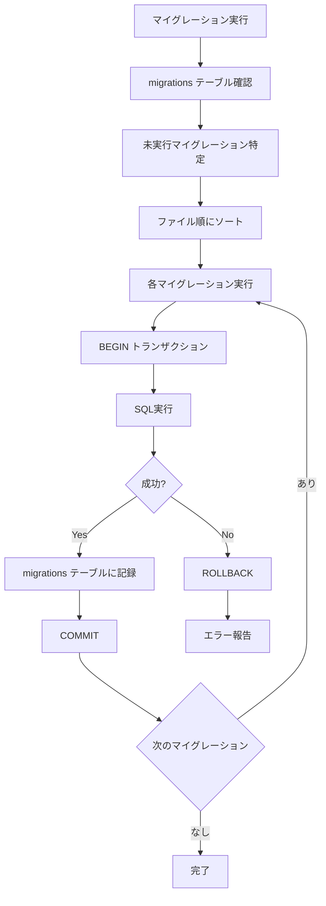

# X Bookmarker マイグレーション実装ガイド

このドキュメントでは、X Bookmarkerのデータベースマイグレーションシステムの実装詳細と使用方法について詳しく解説します。

## マイグレーションシステムの概要

X Bookmarkerのマイグレーションシステムは、データベーススキーマの変更を安全かつ確実に管理するためのシステムです。以下の特徴を持っています：

- **順序管理**: ファイル名による実行順序の保証
- **冪等性**: 何度実行しても同じ結果になる
- **トランザクション**: 各マイグレーションはトランザクション内で実行
- **状態管理**: `migrations` テーブルで実行履歴を管理



## migrate.ts の詳細実装

### 1. データベース接続管理

```typescript
// シングルトンパターンによる接続プール管理
let pool: Pool;

const getPool = (): Pool => {
  if (!pool) {
    pool = new Pool({
      host: process.env.DATABASE_HOST || 'localhost',
      port: parseInt(process.env.DATABASE_PORT || '5432'),
      database: process.env.DATABASE_NAME || 'x_bookmarker',
      user: process.env.DATABASE_USER || 'x_bookmarker',
      password: process.env.DATABASE_PASSWORD || 'x_bookmarker_dev',
      ssl: process.env.DATABASE_SSL === 'true',
      max: parseInt(process.env.DATABASE_POOL_SIZE || '10'),
    });
  }
  return pool;
};
```

**設計のポイント:**

#### 1. **シングルトンパターンの採用**
```typescript
let pool: Pool; // モジュールレベルで単一インスタンス
```
- **メモリ効率**: 複数の接続プールを作成することを防ぐ
- **接続数制御**: データベースへの接続数を適切に管理
- **設定の一元化**: 全てのマイグレーション処理で同じ設定を使用

#### 2. **環境変数による設定**
```typescript
const config = {
  host: process.env.DATABASE_HOST || 'localhost',
  // ... その他の設定
};
```
開発、ステージング、本番環境で異なる設定を使用可能です。

### 2. migrations テーブルの管理

```typescript
const createMigrationsTable = async (): Promise<void> => {
  const client = getPool();
  await client.query(`
    CREATE TABLE IF NOT EXISTS migrations (
      id SERIAL PRIMARY KEY,
      filename VARCHAR(255) NOT NULL UNIQUE,
      applied_at TIMESTAMP WITH TIME ZONE DEFAULT NOW()
    )
  `);
};
```

**テーブル設計の考慮事項:**

#### 1. **SERIAL主キー**
```sql
id SERIAL PRIMARY KEY
```
- **自動採番**: 実行順序の記録
- **参照整合性**: 将来の拡張（ロールバック履歴など）に対応

#### 2. **UNIQUE制約**
```sql
filename VARCHAR(255) NOT NULL UNIQUE
```
- **重複実行防止**: 同じマイグレーションの重複実行を防ぐ
- **ファイル名管理**: ファイル名による一意性保証

#### 3. **タイムスタンプ記録**
```sql
applied_at TIMESTAMP WITH TIME ZONE DEFAULT NOW()
```
- **実行履歴**: いつマイグレーションが実行されたかを記録
- **デバッグ支援**: 問題発生時の調査に活用

### 3. マイグレーション実行ロジック

```typescript
const runMigration = async (filename: string): Promise<void> => {
  const client = getPool();
  const migrationPath = path.join(__dirname, 'migrations', filename);
  const migrationSQL = await fs.readFile(migrationPath, 'utf-8');
  
  await client.query('BEGIN');
  try {
    // マイグレーションSQL実行
    await client.query(migrationSQL);
    
    // 実行記録をmigrationsテーブルに追加
    await client.query(
      'INSERT INTO migrations (filename) VALUES ($1)',
      [filename]
    );
    
    await client.query('COMMIT');
    console.log(`✅ Applied migration: ${filename}`);
  } catch (error) {
    await client.query('ROLLBACK');
    console.error(`❌ Failed to apply migration: ${filename}`, error);
    throw error;
  }
};
```

**トランザクション管理の重要性:**

#### 1. **原子性の保証**
```typescript
await client.query('BEGIN');
// マイグレーション処理
await client.query('COMMIT');
```
- **全体成功または全体失敗**: 中途半端な状態を防ぐ
- **データ整合性**: スキーマの一貫性を保つ

#### 2. **エラー時のロールバック**
```typescript
try {
  // マイグレーション処理
} catch (error) {
  await client.query('ROLLBACK');
  throw error;
}
```
- **安全性**: 失敗時は変更を全て取り消し
- **デバッグ**: エラー状態を明確にする

### 4. メインのマイグレーション関数

```typescript
export const migrate = async (): Promise<MigrationResult> => {
  try {
    await createMigrationsTable();
    
    const appliedMigrations = await getAppliedMigrations();
    const allMigrationFiles = await getMigrationFiles();
    
    const pendingMigrations = allMigrationFiles.filter(
      file => !appliedMigrations.includes(file)
    );
    
    console.log(`📋 Found ${pendingMigrations.length} pending migrations`);
    
    for (const migration of pendingMigrations) {
      await runMigration(migration);
    }
    
    console.log(`🎉 Successfully applied ${pendingMigrations.length} migrations`);
    
    return {
      success: true,
      migrationsRun: pendingMigrations.length,
    };
  } catch (error) {
    console.error('❌ Migration failed:', error);
    return {
      success: false,
      migrationsRun: 0,
      error: error instanceof Error ? error.message : 'Unknown error',
    };
  }
};
```

**実行フローの特徴:**

#### 1. **未実行マイグレーションの特定**
```typescript
const pendingMigrations = allMigrationFiles.filter(
  file => !appliedMigrations.includes(file)
);
```
- **効率性**: 既に実行済みのマイグレーションをスキップ
- **冪等性**: 何度実行しても同じ結果

#### 2. **エラーハンドリング**
```typescript
return {
  success: false,
  migrationsRun: 0,
  error: error instanceof Error ? error.message : 'Unknown error',
};
```
- **型安全性**: TypeScript の型ガードを使用
- **詳細なエラー情報**: デバッグに必要な情報を提供

## マイグレーションファイルの設計パターン

### 1. ファイル命名規則

```
001_create_users_table.sql
002_create_categories_table.sql
003_create_tags_table.sql
004_create_bookmarks_table.sql
005_create_sync_jobs_table.sql
006_create_search_history_table.sql
007_create_default_categories.sql
```

**命名規則の重要性:**

#### 1. **数字プレフィックス**
- **実行順序の保証**: ファイルシステムの辞書順でソート
- **依存関係の管理**: 外部キー制約の順序を正しく管理

#### 2. **説明的な名前**
- **可読性**: ファイル名から内容を推測可能
- **保守性**: 将来の開発者が理解しやすい

### 2. マイグレーションファイルの構造

#### users テーブル作成（001_create_users_table.sql）

```sql
-- Create users table
CREATE TABLE users (
  id UUID PRIMARY KEY DEFAULT uuid_generate_v4(),
  x_user_id VARCHAR(50) UNIQUE NOT NULL,
  username VARCHAR(255) NOT NULL,
  display_name VARCHAR(255) NOT NULL,
  avatar_url TEXT,
  access_token TEXT NOT NULL,
  refresh_token TEXT NOT NULL,
  token_expires_at TIMESTAMP WITH TIME ZONE NOT NULL,
  settings JSONB DEFAULT '{}',
  created_at TIMESTAMP WITH TIME ZONE DEFAULT NOW(),
  updated_at TIMESTAMP WITH TIME ZONE DEFAULT NOW()
);

-- インデックス作成
CREATE INDEX idx_users_x_user_id ON users(x_user_id);
CREATE INDEX idx_users_username ON users(username);

-- トリガー関数作成
CREATE OR REPLACE FUNCTION update_updated_at_column()
RETURNS TRIGGER AS $$
BEGIN
  NEW.updated_at = NOW();
  RETURN NEW;
END;
$$ LANGUAGE plpgsql;

-- トリガー作成
CREATE TRIGGER update_users_updated_at
  BEFORE UPDATE ON users
  FOR EACH ROW
  EXECUTE FUNCTION update_updated_at_column();
```

**マイグレーションファイルのベストプラクティス:**

#### 1. **コメントの活用**
```sql
-- Create users table
-- インデックス作成
-- トリガー関数作成
```
- **文書化**: 各セクションの目的を明確に
- **保守性**: 後から見ても理解しやすい

#### 2. **論理的なグループ化**
1. テーブル作成
2. インデックス作成
3. 関数定義
4. トリガー作成

#### bookmarks テーブルの高度な機能（004_create_bookmarks_table.sql）

```sql
-- 全文検索ベクトル更新関数
CREATE OR REPLACE FUNCTION update_bookmark_search_vector()
RETURNS TRIGGER AS $$
BEGIN
  NEW.search_vector = 
    setweight(to_tsvector('english_unaccent', coalesce(NEW.content, '')), 'A') ||
    setweight(to_tsvector('english_unaccent', coalesce(NEW.author_display_name, '')), 'B') ||
    setweight(to_tsvector('english_unaccent', array_to_string(NEW.tags, ' ')), 'C') ||
    setweight(to_tsvector('english_unaccent', array_to_string(NEW.hashtags, ' ')), 'D');
  RETURN NEW;
END;
$$ LANGUAGE plpgsql;

-- 全文検索トリガー
CREATE TRIGGER update_bookmark_search_vector_trigger
  BEFORE INSERT OR UPDATE ON bookmarks
  FOR EACH ROW EXECUTE FUNCTION update_bookmark_search_vector();
```

**高度な機能の実装:**

#### 1. **重み付き全文検索**
```sql
setweight(to_tsvector('english_unaccent', coalesce(NEW.content, '')), 'A')
```
- **A**: 最高重要度（ツイート本文）
- **B**: 高重要度（作者名）
- **C**: 中重要度（タグ）
- **D**: 低重要度（ハッシュタグ）

#### 2. **null安全な処理**
```sql
coalesce(NEW.content, '')
array_to_string(NEW.tags, ' ')
```
- **coalesce**: NULL値を空文字に変換
- **array_to_string**: 配列を文字列に変換

## seed.ts - 初期データ投入システム

### 1. シードデータの設計思想

```typescript
export const seedDatabase = async (): Promise<SeedResult> => {
  try {
    // 1. マイグレーション実行
    const migrationResult = await migrate();
    
    // 2. シード要否判定
    const needsSeeding = await checkSeedStatus();
    
    // 3. デモデータ作成
    if (needsSeeding) {
      const userId = await createDemoUser();
      await createDemoBookmarks(userId);
    }
    
    return { success: true, message: 'Database seeded successfully' };
  } catch (error) {
    return { success: false, message: 'Seeding failed', error: error.message };
  }
};
```

**シードシステムの特徴:**

#### 1. **べき等性の保証**
```typescript
const checkSeedStatus = async (): Promise<boolean> => {
  const userCount = await client.query('SELECT COUNT(*) FROM users');
  return parseInt(userCount.rows[0].count) === 0;
};
```
- **重複防止**: 既にデータが存在する場合はスキップ
- **安全性**: 本番データを誤って上書きしない

#### 2. **現実的なデモデータ**
```typescript
const demoBookmarks = [
  {
    content: 'ChatGPTの新機能が発表されました！これはすごいイノベーションです。 #AI #ChatGPT #技術',
    author_username: 'openai',
    tags: ['AI', 'ChatGPT', '機械学習'],
    category: '技術・AI'
  },
  // ... その他のデモデータ
];
```
- **リアリティ**: 実際の使用例に近いデータ
- **多様性**: 異なるカテゴリとタグを含む

### 2. デモユーザーの作成

```typescript
const createDemoUser = async (): Promise<string> => {
  const demoUser = {
    x_user_id: 'demo_user_123456',
    username: 'demo_user',
    display_name: 'Demo User',
    access_token: 'demo_access_token',
    refresh_token: 'demo_refresh_token',
    token_expires_at: new Date(Date.now() + 7 * 24 * 60 * 60 * 1000),
    settings: {
      theme: 'light',
      viewMode: 'grid',
      autoSync: true,
      backupEnabled: true,
      aiSuggestions: true,
    },
  };
  
  const result = await pool.query(`
    INSERT INTO users (
      x_user_id, username, display_name, access_token, 
      refresh_token, token_expires_at, settings
    )
    VALUES ($1, $2, $3, $4, $5, $6, $7)
    RETURNING id
  `, [/* パラメータ */]);
  
  return result.rows[0].id;
};
```

**デモユーザー設計のポイント:**

#### 1. **現実的な設定値**
```typescript
settings: {
  theme: 'light',
  viewMode: 'grid',
  autoSync: true,
  // ...
}
```
- **UIテスト**: フロントエンドの動作確認
- **機能テスト**: 各設定項目の動作検証

#### 2. **将来日付の設定**
```typescript
token_expires_at: new Date(Date.now() + 7 * 24 * 60 * 60 * 1000)
```
- **期限切れ防止**: デモ環境での動作保証
- **テスト継続**: 長期間の動作テストが可能

## マイグレーション実行方法

### 1. コマンドライン実行

```bash
# 直接実行
npm run migrate

# または
node -r ts-node/register src/database/migrate.ts

# 環境変数を指定して実行
DATABASE_HOST=localhost \
DATABASE_NAME=x_bookmarker_dev \
npm run migrate
```

### 2. プログラムからの実行

```typescript
import { migrate } from './database/migrate';

const runMigrations = async () => {
  const result = await migrate();
  
  if (result.success) {
    console.log(`✅ ${result.migrationsRun} migrations completed`);
  } else {
    console.error(`❌ Migration failed: ${result.error}`);
    process.exit(1);
  }
};

runMigrations();
```

### 3. Docker環境での実行

```dockerfile
# Dockerfile
FROM node:18-alpine

WORKDIR /app
COPY package*.json ./
RUN npm ci --only=production

COPY . .

# マイグレーション実行
RUN npm run migrate
```

```yaml
# docker-compose.yml
version: '3.8'
services:
  app:
    build: .
    depends_on:
      postgres:
        condition: service_healthy
    environment:
      DATABASE_HOST: postgres
      DATABASE_NAME: x_bookmarker
      DATABASE_USER: x_bookmarker
      DATABASE_PASSWORD: password
    command: ["npm", "run", "migrate"]

  postgres:
    image: postgres:15
    healthcheck:
      test: ["CMD-SHELL", "pg_isready -U x_bookmarker"]
      interval: 5s
      timeout: 5s
      retries: 5
```

## ロールバック戦略

### 1. ロールバック関数の実装

```typescript
export const rollback = async (steps: number = 1): Promise<void> => {
  const client = getPool();
  const result = await client.query(
    'SELECT filename FROM migrations ORDER BY applied_at DESC LIMIT $1',
    [steps]
  );
  
  for (const row of result.rows) {
    await client.query('DELETE FROM migrations WHERE filename = $1', [row.filename]);
    console.log(`🔄 Rolled back migration: ${row.filename}`);
  }
};
```

**ロールバックの制限事項:**

#### 1. **データ損失の可能性**
```sql
-- 危険な操作の例
DROP TABLE bookmarks;        -- データが完全に消失
ALTER TABLE users DROP COLUMN settings;  -- カラムデータが消失
```

#### 2. **推奨されるロールバック戦略**
```sql
-- 安全な変更パターン
-- Step 1: カラム追加（NULL許可）
ALTER TABLE users ADD COLUMN new_field VARCHAR(255);

-- Step 2: データ移行
UPDATE users SET new_field = old_field WHERE old_field IS NOT NULL;

-- Step 3: 制約追加（別のマイグレーション）
ALTER TABLE users ALTER COLUMN new_field SET NOT NULL;

-- Step 4: 旧カラム削除（さらに別のマイグレーション）
ALTER TABLE users DROP COLUMN old_field;
```

### 2. バックアップベースのロールバック

```bash
# マイグレーション前のバックアップ
pg_dump -h localhost -U x_bookmarker -d x_bookmarker \
  --format=custom --compress=9 \
  --file="pre_migration_backup_$(date +%Y%m%d_%H%M%S).dump"

# ロールバック時の復旧
pg_restore -h localhost -U x_bookmarker -d x_bookmarker \
  --clean --if-exists \
  pre_migration_backup_20240115_143000.dump
```

## テストとCI/CD統合

### 1. マイグレーションのテスト

```typescript
// migrate.test.ts
describe('Database Migration', () => {
  let testDb: Pool;

  beforeAll(async () => {
    testDb = new Pool({
      database: 'x_bookmarker_test',
      // ... その他の設定
    });
  });

  afterAll(async () => {
    await testDb.end();
  });

  test('should run all migrations successfully', async () => {
    const result = await migrate();
    
    expect(result.success).toBe(true);
    expect(result.migrationsRun).toBeGreaterThan(0);
  });

  test('should be idempotent', async () => {
    // 1回目の実行
    const firstResult = await migrate();
    expect(firstResult.success).toBe(true);

    // 2回目の実行（変更なし）
    const secondResult = await migrate();
    expect(secondResult.success).toBe(true);
    expect(secondResult.migrationsRun).toBe(0);
  });

  test('should create expected tables', async () => {
    await migrate();
    
    const tables = await testDb.query(`
      SELECT table_name FROM information_schema.tables 
      WHERE table_schema = 'public'
    `);
    
    const tableNames = tables.rows.map(row => row.table_name);
    
    expect(tableNames).toContain('users');
    expect(tableNames).toContain('bookmarks');
    expect(tableNames).toContain('categories');
    expect(tableNames).toContain('migrations');
  });
});
```

### 2. GitHub Actions での自動実行

```yaml
# .github/workflows/database.yml
name: Database Migration Test

on: [push, pull_request]

jobs:
  migrate:
    runs-on: ubuntu-latest
    
    services:
      postgres:
        image: postgres:15
        env:
          POSTGRES_PASSWORD: password
          POSTGRES_USER: x_bookmarker
          POSTGRES_DB: x_bookmarker_test
        options: >-
          --health-cmd pg_isready
          --health-interval 10s
          --health-timeout 5s
          --health-retries 5

    steps:
      - uses: actions/checkout@v3
      
      - name: Setup Node.js
        uses: actions/setup-node@v3
        with:
          node-version: '18'
          cache: 'npm'
      
      - name: Install dependencies
        run: npm ci
      
      - name: Run migrations
        env:
          DATABASE_HOST: localhost
          DATABASE_NAME: x_bookmarker_test
          DATABASE_USER: x_bookmarker
          DATABASE_PASSWORD: password
        run: npm run migrate
      
      - name: Run migration tests
        env:
          DATABASE_HOST: localhost
          DATABASE_NAME: x_bookmarker_test
          DATABASE_USER: x_bookmarker
          DATABASE_PASSWORD: password
        run: npm run test:migrate
```

## 本番環境でのマイグレーション

### 1. 本番デプロイ手順

```bash
#!/bin/bash
# deploy.sh

set -e  # エラーで停止

echo "🚀 Starting production deployment..."

# 1. データベースバックアップ
echo "📦 Creating database backup..."
pg_dump -h $DATABASE_HOST -U $DATABASE_USER -d $DATABASE_NAME \
  --format=custom --compress=9 \
  --file="backup_pre_deploy_$(date +%Y%m%d_%H%M%S).dump"

# 2. アプリケーション停止
echo "⏸️  Stopping application..."
systemctl stop x-bookmarker

# 3. マイグレーション実行
echo "🔄 Running database migrations..."
npm run migrate

if [ $? -ne 0 ]; then
  echo "❌ Migration failed! Rolling back..."
  systemctl start x-bookmarker
  exit 1
fi

# 4. アプリケーション開始
echo "▶️  Starting application..."
systemctl start x-bookmarker

# 5. ヘルスチェック
echo "🏥 Performing health check..."
curl -f http://localhost:3001/health || {
  echo "❌ Health check failed!"
  exit 1
}

echo "✅ Deployment completed successfully!"
```

### 2. ゼロダウンタイム マイグレーション

```sql
-- 段階的なスキーマ変更の例

-- Phase 1: 新しいカラムを追加（NULL許可）
ALTER TABLE users ADD COLUMN email VARCHAR(255);

-- Phase 2: アプリケーションを更新（両方のカラムをサポート）
-- デプロイ完了まで待機

-- Phase 3: データ移行
UPDATE users SET email = username || '@example.com' WHERE email IS NULL;

-- Phase 4: 制約追加
ALTER TABLE users ALTER COLUMN email SET NOT NULL;
ALTER TABLE users ADD CONSTRAINT unique_email UNIQUE (email);

-- Phase 5: 旧カラム削除（次回のマイグレーション）
-- ALTER TABLE users DROP COLUMN old_email_field;
```

## まとめ

X Bookmarkerのマイグレーションシステムは、以下の特徴を持つ堅牢な実装になっています：

- **安全性**: トランザクション管理とロールバック機能
- **冪等性**: 何度実行しても同じ結果になる設計
- **拡張性**: 新しいマイグレーションを簡単に追加可能
- **可視性**: 詳細なログ出力と実行状況の追跡
- **テスト可能性**: 自動テストとCI/CD統合

このシステムにより、データベーススキーマの変更を安全かつ確実に管理し、チーム開発での一貫性を保つことができます。

---

> 💡 **関連ドキュメント**: 
> - [データベースアーキテクチャ](./database-architecture.md)
> - [ブックマーク管理システム](./bookmark-architecture.md)