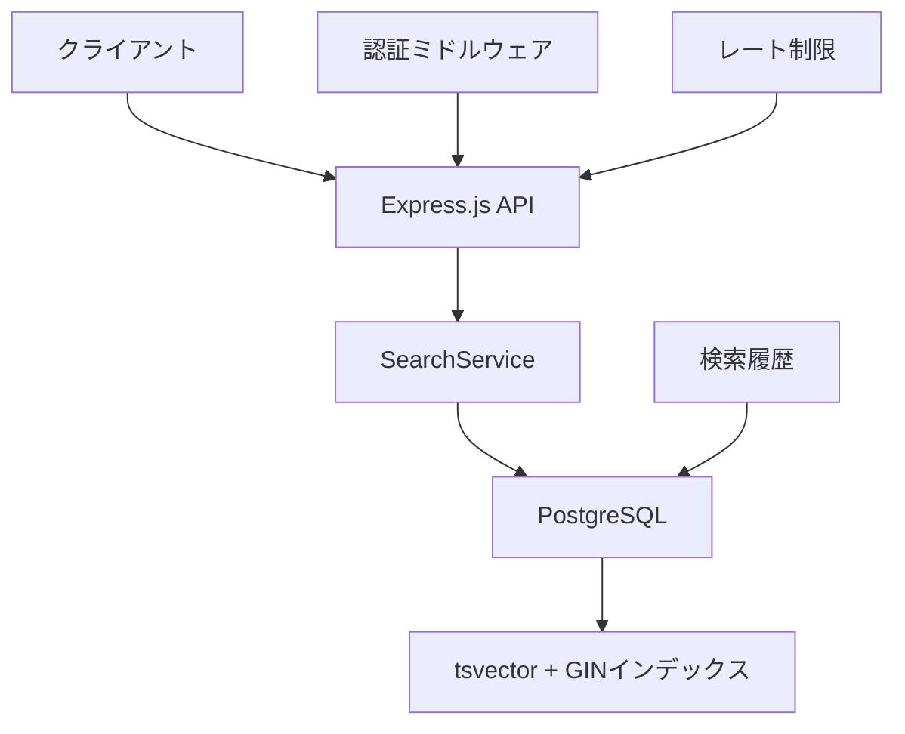

# X Bookmarker 検索アーキテクチャ完全ガイド

このドキュメントでは、X Bookmarkerの検索システムの設計思想と実装について、初心者にも分かりやすく解説します。

## 概要

X Bookmarkerの検索システムは、PostgreSQLの全文検索機能を活用した高性能な検索エンジンです。単純なキーワード検索から、カテゴリ、タグ、作者による絞り込み、さらにはファセット検索まで対応しています。

## なぜPostgreSQLの全文検索を選んだのか？

### 1. **統合性** 
既存のPostgreSQLデータベースに追加のインフラを必要とせず、検索機能を追加できます。

### 2. **パフォーマンス**
GINインデックスを使用することで、大量のデータに対しても高速な検索を実現します。

### 3. **柔軟性**
SQLの力を活用して、複雑な検索条件や集計処理を効率的に実行できます。

## システム全体の構成



## 主要コンポーネント

### 1. 検索ルート (/routes/search.ts)
APIエンドポイントを提供し、リクエストの検証と認証を行います。

### 2. SearchService (/services/searchService.ts)
検索のビジネスロジックを担当し、データベースクエリの構築と実行を行います。

### 3. データベース設計
PostgreSQLの`tsvector`型とGINインデックスを使用した全文検索テーブル構造。

## 検索機能の特徴

### ✨ 高度な検索機能
- **全文検索**: ツイート内容の自然言語検索
- **ファセット検索**: カテゴリ、タグ、作者による絞り込み
- **日付範囲検索**: 特定期間のブックマークを検索
- **メディア/リンクフィルタ**: 画像や外部リンクの有無での絞り込み

### ✨ パフォーマンス最適化
- **GINインデックス**: 高速な全文検索を実現
- **効率的なSQL**: 複雑な条件でも最適化されたクエリを生成
- **ファセット集約**: 単一クエリで検索結果と統計情報を取得

### ✨ ユーザビリティ
- **検索履歴**: 過去の検索を保存・管理
- **検索候補**: オートコンプリート機能
- **検索分析**: 利用統計とトレンド分析

## データベーススキーマ

### bookmarksテーブル
```sql
CREATE TABLE bookmarks (
    id UUID PRIMARY KEY,
    user_id UUID NOT NULL,
    x_tweet_id VARCHAR(255),
    content TEXT,
    author_username VARCHAR(255),
    author_display_name VARCHAR(255),
    tags TEXT[],
    search_vector tsvector, -- 全文検索用
    created_at TIMESTAMPTZ DEFAULT NOW()
);

-- 全文検索用GINインデックス
CREATE INDEX idx_bookmarks_search_vector 
ON bookmarks USING gin(search_vector);
```

### search_historyテーブル
```sql
CREATE TABLE search_history (
    id UUID PRIMARY KEY,
    user_id UUID NOT NULL,
    query JSONB NOT NULL,
    result_count INTEGER,
    execution_time INTEGER,
    created_at TIMESTAMPTZ DEFAULT NOW()
);
```

## 検索クエリの構築プロセス

### 1. 基本クエリの作成
```typescript
let searchQuery = `
  SELECT b.*, c.name as category_name
  FROM bookmarks b
  LEFT JOIN categories c ON b.category_id = c.id
  WHERE b.user_id = $1
`;
```

### 2. 全文検索の追加
```typescript
if (query.text) {
  searchQuery += ` AND b.search_vector @@ plainto_tsquery('english_unaccent', $2)`;
}
```

### 3. フィルタの追加
```typescript
if (query.categoryIds?.length > 0) {
  searchQuery += ` AND b.category_id = ANY($${paramIndex})`;
}
```

### 4. ソートとページネーション
```typescript
searchQuery += ` ORDER BY ts_rank(b.search_vector, plainto_tsquery('english_unaccent', $1)) DESC`;
searchQuery += ` LIMIT $${paramIndex} OFFSET $${paramIndex + 1}`;
```

## ファセット検索の仕組み

ファセット検索では、検索結果と同時に、各カテゴリやタグの該当件数を取得します：

```typescript
// カテゴリファセット
const categoryFacetQuery = `
  SELECT 
    c.id, c.name, c.color, c.icon,
    COUNT(b.id) as count
  FROM categories c
  LEFT JOIN bookmarks b ON c.id = b.category_id 
    AND b.user_id = $1 
    AND b.search_vector @@ plainto_tsquery('english_unaccent', $2)
  GROUP BY c.id, c.name, c.color, c.icon
  HAVING COUNT(b.id) > 0
  ORDER BY count DESC
`;
```

## パフォーマンス最適化のポイント

### 1. **適切なインデックス**
```sql
-- 全文検索用
CREATE INDEX idx_bookmarks_search_vector ON bookmarks USING gin(search_vector);

-- フィルタ用
CREATE INDEX idx_bookmarks_user_category ON bookmarks(user_id, category_id);
CREATE INDEX idx_bookmarks_user_archived ON bookmarks(user_id, is_archived);
```

### 2. **効率的なクエリ設計**
- 必要な列のみを選択
- 適切なJOINの使用
- WHERE句の最適化

### 3. **検索ベクトルの更新**
```sql
-- ブックマーク作成時に検索ベクトルを生成
UPDATE bookmarks 
SET search_vector = to_tsvector('english_unaccent', 
    COALESCE(content, '') || ' ' || 
    COALESCE(author_display_name, '') || ' ' ||
    COALESCE(array_to_string(tags, ' '), '')
)
WHERE id = $1;
```

## セキュリティ考慮事項

### 1. **ユーザー分離**
すべてのクエリで`user_id`による絞り込みを行い、他のユーザーのデータにアクセスできないようにします。

### 2. **SQLインジェクション対策**
パラメータ化クエリを使用し、ユーザー入力を直接SQLに埋め込まないようにします。

### 3. **レート制限**
検索APIにレート制限を適用し、悪意のあるリクエストを防ぎます。

## 次のステップ

このアーキテクチャ文書を読んだ後は、以下のドキュメントを参照してください：

1. [SearchServiceガイド](./searchservice-guide.md) - 実装の詳細
2. [検索API リファレンス](./search-api-reference.md) - APIの使用方法

## まとめ

X Bookmarkerの検索システムは、PostgreSQLの強力な全文検索機能を活用することで、高性能でスケーラブルな検索体験を提供します。適切なインデックス設計とクエリ最適化により、大量のデータに対しても高速な検索が可能です。

---

> 💡 **ヒント**: このシステムを拡張する際は、検索パフォーマンスを監視し、必要に応じてインデックスの追加や調整を行ってください。