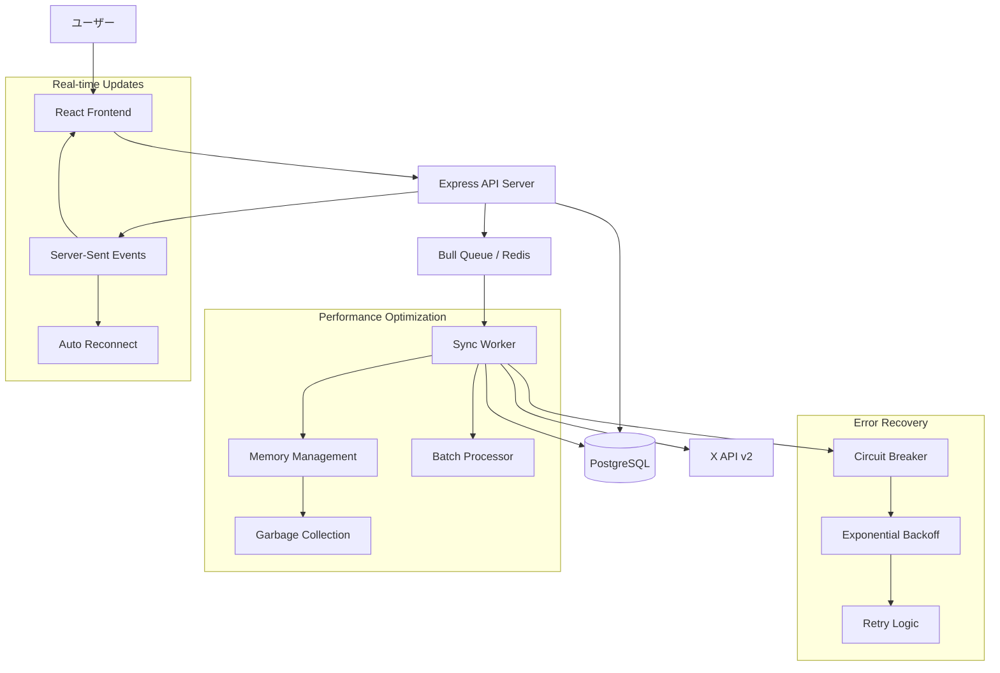

# ブックマーク同期機能アーキテクチャガイド

## 概要

このドキュメントでは、X Bookmarkerのブックマーク同期機能の包括的なアーキテクチャについて説明します。高性能、高可用性、そしてユーザビリティを重視した設計により、大規模なブックマークデータの効率的な同期を実現しています。

## システム構成図



## 主要コンポーネント

### 1. キュー管理システム (Bull Queue)

#### 設計理念
- **非同期処理**: UIのブロッキングを防ぎ、ユーザビリティを向上
- **優先度制御**: フル同期と通常同期の適切な優先度設定
- **リトライ管理**: 指数バックオフによる智的なリトライ機能

#### 主要機能

```typescript
// キュー設定例
const syncQueue = new Bull('bookmark-sync', {
  redis: redisConfig,
  defaultJobOptions: {
    removeOnComplete: 10,  // 完了ジョブの保持数
    removeOnFail: 50,      // 失敗ジョブの保持数
    attempts: 3,           // 最大リトライ回数
    backoff: {
      type: 'exponential',
      delay: 2000,         // 初期遅延時間
    },
  },
});
```

#### パフォーマンス最適化
- **並行処理制御**: 最大3つの同期ジョブを並行実行
- **メモリ効率**: 完了・失敗ジョブの自動削除による メモリ使用量の制御
- **負荷分散**: Redis Clusterによる水平スケーリング対応

### 2. エラー回復メカニズム

#### サーキットブレーカーパターン

```typescript
interface CircuitBreakerOptions {
  failureThreshold: number;    // 失敗回数閾値 (デフォルト: 5)
  successThreshold: number;    // 成功回数閾値 (デフォルト: 3)
  timeout: number;            // タイムアウト時間 (デフォルト: 60秒)
  monitoringPeriod: number;   // 監視期間 (デフォルト: 5分)
}
```

**状態遷移図**:
```
CLOSED → (5回失敗) → OPEN → (60秒経過) → HALF_OPEN → (3回成功) → CLOSED
                               ↓ (失敗時)
                            OPEN
```

#### 指数バックオフ戦略

```typescript
// 遅延時間計算式
delay = baseDelay * Math.pow(2, attempts)
jitteredDelay = delay * (0.5 + Math.random() * 0.5)
finalDelay = Math.min(jitteredDelay, maxDelay)
```

**利点**:
- **サンダリングハード回避**: ジッター追加による同時リクエスト分散
- **適応的遅延**: 障害の深刻度に応じた待機時間調整
- **リソース保護**: 過負荷状態でのシステム保護

### 3. パフォーマンス最適化

#### メモリ管理戦略

```typescript
const PERFORMANCE_SETTINGS = {
  BATCH_SIZE: 100,                    // X API リクエストバッチサイズ
  DB_BATCH_SIZE: 50,                  // データベース書き込みバッチサイズ
  MAX_CONCURRENT_REQUESTS: 3,         // 最大並行リクエスト数
  MEMORY_CLEANUP_INTERVAL: 10,        // メモリクリーンアップ間隔
  MAX_MEMORY_USAGE_MB: 512,          // メモリ使用量制限
};
```

#### バッチ処理最適化

**段階的処理アプローチ**:
1. **取得フェーズ** (0-50%): X APIからのデータ取得
2. **処理フェーズ** (50-100%): データベースへの保存

**メモリ効率化手法**:
- **チャンク処理**: 大量データの分割処理
- **ガベージコレクション**: 定期的なメモリ解放
- **ストリーミング処理**: メモリフットプリントの最小化

### 4. リアルタイム通信 (Server-Sent Events)

#### SSE接続管理

```typescript
interface SSEConnectionState {
  status: 'connecting' | 'connected' | 'disconnected' | 'error' | 'reconnecting';
  reconnectAttempts: number;
  connectionHealth: 'good' | 'poor' | 'failed';
}
```

#### 自動再接続機能

**再接続戦略**:
- **指数バックオフ**: 1秒 → 2秒 → 4秒 → 8秒 → 16秒 → 30秒 (上限)
- **健全性チェック**: 15秒以上メッセージがない場合は接続品質を「poor」に設定
- **最大試行回数**: 5回の再接続試行後に手動再接続が必要

#### プログレス更新最適化

```typescript
const PROGRESS_UPDATE_SETTINGS = {
  UPDATE_INTERVAL: 2000,          // 2秒間隔での進捗更新
  HEALTH_CHECK_INTERVAL: 5000,    // 5秒間隔での接続健全性チェック
  CONNECTION_TIMEOUT: 30000,      // 30秒のタイムアウト
};
```

## API エンドポイント仕様

### 同期開始
```http
POST /api/sync
Content-Type: application/json

{
  "fullSync": false,
  "forceSync": false
}
```

**レスポンス**:
```json
{
  "success": true,
  "jobId": "job_12345",
  "message": "Bookmark sync started",
  "options": {
    "fullSync": false,
    "forceSync": false
  }
}
```

### 同期状況取得
```http
GET /api/sync/status/{jobId}
```

**レスポンス**:
```json
{
  "success": true,
  "job": {
    "id": "job_12345",
    "userId": "user_789",
    "status": "running",
    "progress": {
      "total": 1000,
      "processed": 250,
      "percentage": 25,
      "currentItem": "バッチ 3 / 10 (250件取得済み)",
      "errors": []
    },
    "createdAt": "2024-01-15T10:30:00.000Z",
    "processedOn": "2024-01-15T10:30:05.000Z"
  }
}
```

### リアルタイム進捗 (SSE)
```http
GET /api/sse/events/{jobId}
Accept: text/event-stream
```

**イベントストリーム**:
```
data: {"type":"connected","jobId":"job_12345"}

data: {"type":"progress","jobId":"job_12345","status":"running","progress":{"total":1000,"processed":250,"percentage":25,"currentItem":"バッチ 3 / 10","errors":[]},"timestamp":"2024-01-15T10:30:15.000Z"}

data: {"type":"progress","jobId":"job_12345","status":"completed","result":{"totalFetched":1000,"newBookmarks":600,"updatedBookmarks":400,"errors":[],"syncTime":45000},"timestamp":"2024-01-15T10:35:00.000Z"}
```

## エラーハンドリング戦略

### エラー分類と対応

| エラータイプ | HTTPステータス | 対応戦略 | リトライ |
|-------------|----------------|----------|----------|
| レート制限 | 429 | 指数バックオフ + 待機 | ✅ |
| 認証エラー | 401 | トークンリフレッシュ | ❌ |
| 権限エラー | 403 | ユーザー通知 + 停止 | ❌ |
| サーバーエラー | 5xx | 指数バックオフ | ✅ |
| ネットワークエラー | - | 短期リトライ | ✅ |
| データベースエラー | - | 短期リトライ | ✅ |

### 部分失敗処理

```typescript
interface SyncResult {
  totalFetched: number;
  newBookmarks: number;
  updatedBookmarks: number;
  errors: string[];           // 個別エラーの記録
  partialSuccess: boolean;    // 部分成功フラグ
  syncTime: number;
}
```

**部分失敗時の動作**:
1. エラーを詳細ログに記録
2. 処理可能なデータは正常に保存
3. エラー概要をユーザーに通知
4. 次回同期時に失敗分の再処理

## パフォーマンス指標とモニタリング

### 重要指標 (KPI)

| 指標名 | 目標値 | 測定方法 |
|--------|--------|----------|
| 同期完了時間 | < 3分 (1000件) | ジョブ開始〜完了時間 |
| エラー率 | < 5% | 失敗ジョブ / 総ジョブ数 |
| メタデータ取得成功率 | > 95% | 成功レコード / 総レコード数 |
| メモリ使用量 | < 512MB | プロセスメモリ監視 |
| CPU使用率 | < 70% | システムリソース監視 |

### ログ出力例

```typescript
// 成功ログ
logger.info('ブックマーク同期完了', {
  jobId: 'job_12345',
  userId: 'user_789',
  performance: {
    totalTime: 45000,           // 45秒
    averageTimePerItem: 45,     // 45ms/件
    itemsPerSecond: 22,         // 22件/秒
    finalMemoryUsage: {
      heapUsed: 128,            // 128MB
      rss: 256                  // 256MB
    }
  },
  result: {
    totalFetched: 1000,
    newBookmarks: 600,
    updatedBookmarks: 400,
    errors: []
  }
});
```

## トラブルシューティング

### よくある問題と解決策

#### 1. メモリ不足エラー
**症状**: `JavaScript heap out of memory` エラー
**原因**: 大量データの一括処理
**解決策**: 
- バッチサイズを削減 (`BATCH_SIZE: 50`)
- ガベージコレクション頻度を増加
- Node.js起動オプション: `--max-old-space-size=2048`

#### 2. レート制限超過
**症状**: 429エラーが頻発
**原因**: X APIの制限 (75 requests/15分) 超過
**解決策**:
- リクエスト間隔を調整 (`waitTime: 2000ms`)
- 並行処理数を削減 (`MAX_CONCURRENT_REQUESTS: 1`)
- フル同期の頻度を制限

#### 3. データベース接続エラー
**症状**: 接続プールエラーやタイムアウト
**原因**: 大量の同時接続や長時間クエリ
**解決策**:
- 接続プール設定の調整
- クエリタイムアウトの最適化
- バッチサイズの削減

## 設定とカスタマイズ

### 環境変数設定

```bash
# Redis設定
REDIS_HOST=localhost
REDIS_PORT=6379
REDIS_PASSWORD=your_password

# X API設定
X_API_CLIENT_ID=your_client_id
X_API_CLIENT_SECRET=your_client_secret
X_API_RATE_LIMIT_BUFFER=5

# パフォーマンス設定
SYNC_BATCH_SIZE=100
SYNC_DB_BATCH_SIZE=50
SYNC_MAX_CONCURRENT=3
SYNC_MEMORY_LIMIT_MB=512

# エラー回復設定
CIRCUIT_BREAKER_FAILURE_THRESHOLD=5
CIRCUIT_BREAKER_TIMEOUT=60000
EXPONENTIAL_BACKOFF_BASE_DELAY=2000
MAX_RETRY_ATTEMPTS=3
```

### 本番環境推奨設定

```typescript
const productionConfig = {
  queue: {
    concurrency: 2,           // 本番では保守的に
    removeOnComplete: 5,      // ストレージ効率化
    removeOnFail: 20,         // 失敗ログは多めに保持
  },
  circuitBreaker: {
    failureThreshold: 3,      // より敏感に
    timeout: 30000,           // 短めの回復時間
  },
  performance: {
    batchSize: 50,            // 小さめのバッチ
    memoryLimit: 256,         // 制限的なメモリ使用
    cleanupInterval: 5,       // 頻繁なクリーンアップ
  },
  monitoring: {
    healthCheckInterval: 30000,
    alertThreshold: {
      errorRate: 0.03,        // 3%エラー率でアラート
      responseTime: 180000,   // 3分でタイムアウト
    },
  },
};
```

## まとめ

X Bookmarkerの同期機能は、以下の設計原則に基づいて構築されています：

1. **信頼性**: サーキットブレーカーと指数バックオフによる堅牢なエラー処理
2. **パフォーマンス**: メモリ効率的なバッチ処理と最適化されたデータフロー
3. **ユーザビリティ**: リアルタイム進捗表示と自動再接続機能
4. **スケーラビリティ**: Redis Clusterとデータベース分散に対応した設計
5. **監視可能性**: 包括的なログ出力とメトリクス収集

この設計により、大規模なブックマークデータも効率的かつ安全に同期することが可能です。