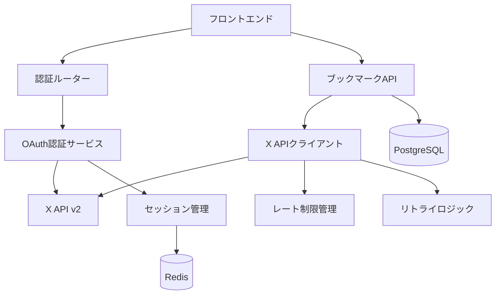

# X API統合サービス実装ガイド

## 概要

X Bookmarkerにおける X (Twitter) API v2統合の完全実装ガイドです。OAuth 2.0認証からブックマーク取得、レート制限管理まで、実際のサービス運用に必要な全要素を解説します。

## アーキテクチャ概要

### システム構成



### コンポーネント責務

1. **OAuth認証サービス** (`src/auth/oauth.ts`)
   - X OAuth 2.0フローの実装
   - PKCE (Proof Key for Code Exchange) セキュリティ
   - アクセストークン・リフレッシュトークン管理

2. **X APIクライアント** (`src/services/xApiClient.ts`)
   - ブックマーク取得API
   - レート制限自動管理
   - 指数バックオフリトライ

3. **セッション管理** (`src/auth/session.ts`)
   - Redisベースセッション
   - トークン暗号化保存
   - セッション有効期限管理

## OAuth 2.0 認証フロー

### 実装の特徴

```typescript
// PKCEによるセキュリティ強化
const codeVerifier = crypto.randomBytes(32).toString('base64url');
const codeChallenge = crypto
  .createHash('sha256')
  .update(codeVerifier)
  .digest('base64url');

// state パラメータでCSRF攻撃防止
const state = {
  userId: user.id,
  timestamp: Date.now(),
  nonce: crypto.randomBytes(16).toString('hex')
};
```

### 認証フロー詳細

1. **認証開始** (`/auth/x/oauth`)
   ```typescript
   const authUrl = await oauthService.generateAuthorizationUrl({
     scope: ['bookmark.read', 'tweet.read', 'users.read'],
     codeChallenge,
     state: encryptedState
   });
   ```

2. **コールバック処理** (`/auth/x/callback`)
   ```typescript
   const tokens = await oauthService.exchangeCodeForTokens({
     code,
     codeVerifier,
     state
   });
   ```

3. **トークン更新**
   ```typescript
   const newTokens = await oauthService.refreshAccessToken(refreshToken);
   ```

## X API ブックマーク取得

### 基本的な使用方法

```typescript
const client = new XApiClient({
  baseURL: 'https://api.twitter.com/2',
  bearerToken: userAccessToken,
  timeout: 30000,
  retryAttempts: 3,
  retryDelay: 1000,
  rateLimitBuffer: 5
});

// ブックマーク取得
const bookmarks = await client.getBookmarks({
  userId: user.xId,
  maxResults: 100,
  tweetFields: [
    'created_at',
    'public_metrics',
    'author_id',
    'lang',
    'context_annotations'
  ],
  userFields: [
    'username',
    'name',
    'profile_image_url',
    'verified'
  ],
  mediaFields: [
    'url',
    'preview_image_url',
    'type',
    'width',
    'height'
  ],
  expansions: [
    'author_id',
    'attachments.media_keys',
    'referenced_tweets.id'
  ]
});
```

### ページネーション実装

```typescript
async function getAllBookmarks(userId: string) {
  const allBookmarks = [];
  let paginationToken: string | undefined;

  do {
    const response = await client.getBookmarks({
      userId,
      maxResults: 100,
      paginationToken,
      // ... fields
    });

    allBookmarks.push(...response.data.data || []);
    paginationToken = response.data.meta?.next_token;

    // レート制限チェック
    if (response.rateLimit.remaining <= 5) {
      const waitTime = (response.rateLimit.reset - Math.floor(Date.now() / 1000)) * 1000;
      await new Promise(resolve => setTimeout(resolve, waitTime + 1000));
    }

  } while (paginationToken);

  return allBookmarks;
}
```

## レート制限管理

### X API制限値

- **ブックマークAPI**: 75 requests / 15分
- **ユーザー情報API**: 300 requests / 15分
- **ツイート詳細API**: 300 requests / 15分

### プロアクティブ制限管理

```typescript
private async checkRateLimit(): Promise<void> {
  if (!this.rateLimitInfo) {
    return;
  }

  const now = Math.floor(Date.now() / 1000);
  const { remaining, reset } = this.rateLimitInfo;

  // バッファを考慮した制限チェック
  if (remaining > this.config.rateLimitBuffer && reset > now) {
    return;
  }

  // 制限リセット時刻まで待機
  if (reset > now) {
    const waitTime = (reset - now) * 1000;
    console.log(`⏳ レート制限待機: ${Math.round(waitTime / 1000)}秒`);
    await this.sleep(waitTime + 1000); // 1秒バッファ追加
  }
}
```

### 指数バックオフリトライ

```typescript
private async makeRequest<T>(config: XApiRequestConfig): Promise<XApiResponse<T>> {
  const maxRetries = config.retryCount || this.config.retryAttempts;
  let lastError: Error;

  for (let attempt = 0; attempt <= maxRetries; attempt++) {
    try {
      return await this.client.get(config.endpoint, {
        params: config.params,
        headers: config.headers,
      });
    } catch (error) {
      lastError = error as Error;

      // 4xxエラーはリトライしない（429を除く）
      if (this.isClientError(error) && error.status !== 429) {
        throw error;
      }

      // 指数バックオフ計算
      const baseDelay = this.config.retryDelay;
      const exponentialDelay = baseDelay * Math.pow(2, attempt);
      const jitterDelay = exponentialDelay + Math.random() * 1000;
      const delay = Math.min(jitterDelay, 60000); // 60秒上限

      console.log(`🔄 リトライ ${attempt + 1}/${maxRetries + 1}: ${delay}ms待機`);
      await this.sleep(delay);
    }
  }

  throw lastError!;
}
```

## エラーハンドリング

### X APIエラー分類

```typescript
// 認証エラー
if (status === 401) {
  const apiError = {
    type: 'authentication_error',
    title: 'Authentication Failed',
    detail: 'Bearer token is invalid or expired',
    value: null
  };
  throw new XApiRequestError(apiError, status);
}

// 権限エラー
if (status === 403) {
  const apiError = {
    type: 'authorization_error',
    title: 'Insufficient Permissions',
    detail: 'Required scopes or permissions are missing',
    value: null
  };
  throw new XApiRequestError(apiError, status);
}

// レート制限エラー
if (status === 429) {
  const retryAfter = this.getRetryAfter(response);
  throw new XApiRateLimitError(retryAfter, this.rateLimitInfo);
}
```

### カスタムエラークラス

```typescript
export class XApiRateLimitError extends Error {
  constructor(
    public retryAfter: number,
    public rateLimitInfo: RateLimitInfo | null
  ) {
    super(`X API rate limit exceeded. Retry after ${retryAfter}ms`);
    this.name = 'XApiRateLimitError';
  }
}

export class XApiRequestError extends Error {
  constructor(
    public apiError: XApiError,
    public status: number
  ) {
    super(`X API request failed: ${apiError.detail}`);
    this.name = 'XApiRequestError';
  }
}
```

## セキュリティ考慮事項

### トークン管理

1. **暗号化保存**
   ```typescript
   // アクセストークンの暗号化
   const encryptedToken = this.encrypt(accessToken, this.config.encryptionKey);
   await this.sessionService.setSession(sessionId, {
     userId,
     encryptedToken,
     expiresAt: Date.now() + tokenExpiresIn * 1000
   });
   ```

2. **自動トークン更新**
   ```typescript
   // トークン有効期限チェック
   if (session.expiresAt - Date.now() < 300000) { // 5分前
     const newTokens = await this.refreshAccessToken(session.refreshToken);
     await this.updateSessionTokens(sessionId, newTokens);
   }
   ```

3. **スコープ制限**
   ```typescript
   const requiredScopes = ['bookmark.read', 'tweet.read', 'users.read'];
   // 最小権限の原則に従ったスコープ設定
   ```

### PKCE実装

```typescript
// コードベリファイア生成
const codeVerifier = crypto.randomBytes(32).toString('base64url');

// コードチャレンジ生成
const codeChallenge = crypto
  .createHash('sha256')
  .update(codeVerifier)
  .digest('base64url');

// 認証URL生成
const authUrl = `${this.AUTHORIZATION_URL}?` + new URLSearchParams({
  response_type: 'code',
  client_id: this.config.clientId,
  redirect_uri: this.config.redirectUri,
  scope: scopes.join(' '),
  state: encryptedState,
  code_challenge: codeChallenge,
  code_challenge_method: 'S256'
}).toString();
```

## 監視とログ

### 構造化ログ

```typescript
// API呼び出しログ
console.log(`📤 X API リクエスト: GET /users/${userId}/bookmarks`, {
  userId,
  maxResults,
  timestamp: new Date().toISOString(),
  rateLimitRemaining: this.rateLimitInfo?.remaining
});

// レート制限監視
console.warn(`🚨 レート制限警告: ${remaining}/${limit} (${percentage}%)`, {
  endpoint: '/users/:id/bookmarks',
  resetTime: new Date(reset * 1000).toISOString(),
  minutesUntilReset: Math.ceil(resetIn / 60)
});
```

### メトリクス収集

```typescript
// API使用量追跡
const metrics = {
  totalRequests: 0,
  successfulRequests: 0,
  rateLimitHits: 0,
  averageResponseTime: 0,
  errorsByType: new Map<string, number>()
};
```

## テスト戦略

### ユニットテスト

```typescript
describe('XApiClient', () => {
  it('should handle rate limit properly', async () => {
    const mockResponse = {
      headers: {
        'x-rate-limit-limit': '75',
        'x-rate-limit-remaining': '5',
        'x-rate-limit-reset': String(Math.floor(Date.now() / 1000) + 900)
      }
    };

    const client = new XApiClient(testConfig);
    // テスト実装...
  });
});
```

### 統合テスト

```typescript
describe('OAuth Flow Integration', () => {
  it('should complete full OAuth flow', async () => {
    // 1. 認証URL生成
    const authUrl = await oauthService.generateAuthorizationUrl({...});
    
    // 2. コールバック処理
    const tokens = await oauthService.exchangeCodeForTokens({...});
    
    // 3. トークンでAPI呼び出し
    const bookmarks = await xApiClient.getBookmarks({...});
    
    expect(bookmarks.success).toBe(true);
  });
});
```

## パフォーマンス最適化

### バッチ処理

```typescript
// 複数ユーザーの並列同期
async function syncMultipleUsers(userIds: string[]) {
  const batchSize = 5; // 並列度制限
  
  for (let i = 0; i < userIds.length; i += batchSize) {
    const batch = userIds.slice(i, i + batchSize);
    
    await Promise.all(
      batch.map(userId => syncUserBookmarks(userId))
    );
    
    // バッチ間に待機時間
    if (i + batchSize < userIds.length) {
      await new Promise(resolve => setTimeout(resolve, 2000));
    }
  }
}
```

### キャッシュ戦略

```typescript
// Redis キャッシュ
const cacheKey = `bookmarks:${userId}:${paginationToken || 'first'}`;
const cachedResult = await redis.get(cacheKey);

if (cachedResult) {
  return JSON.parse(cachedResult);
}

const result = await this.fetchFromAPI(params);
await redis.setex(cacheKey, 300, JSON.stringify(result)); // 5分キャッシュ
```

## 本番運用

### 環境設定

```bash
# X API設定
X_API_CLIENT_ID=your_client_id
X_API_CLIENT_SECRET=your_client_secret
X_API_REDIRECT_URI=https://your-domain.com/auth/x/callback

# 暗号化キー
OAUTH_ENCRYPTION_KEY=your-256-bit-encryption-key
SESSION_ENCRYPTION_KEY=your-session-encryption-key

# Redis設定
REDIS_URL=redis://localhost:6379
```

### 監視設定

- レート制限使用率アラート (80%以上)
- API エラー率監視 (5%以上)
- レスポンス時間監視 (3秒以上)
- トークン更新失敗アラート

この実装により、X Bookmarkerは安全で効率的な X API統合を実現し、ユーザーに安定したブックマーク同期サービスを提供できます。